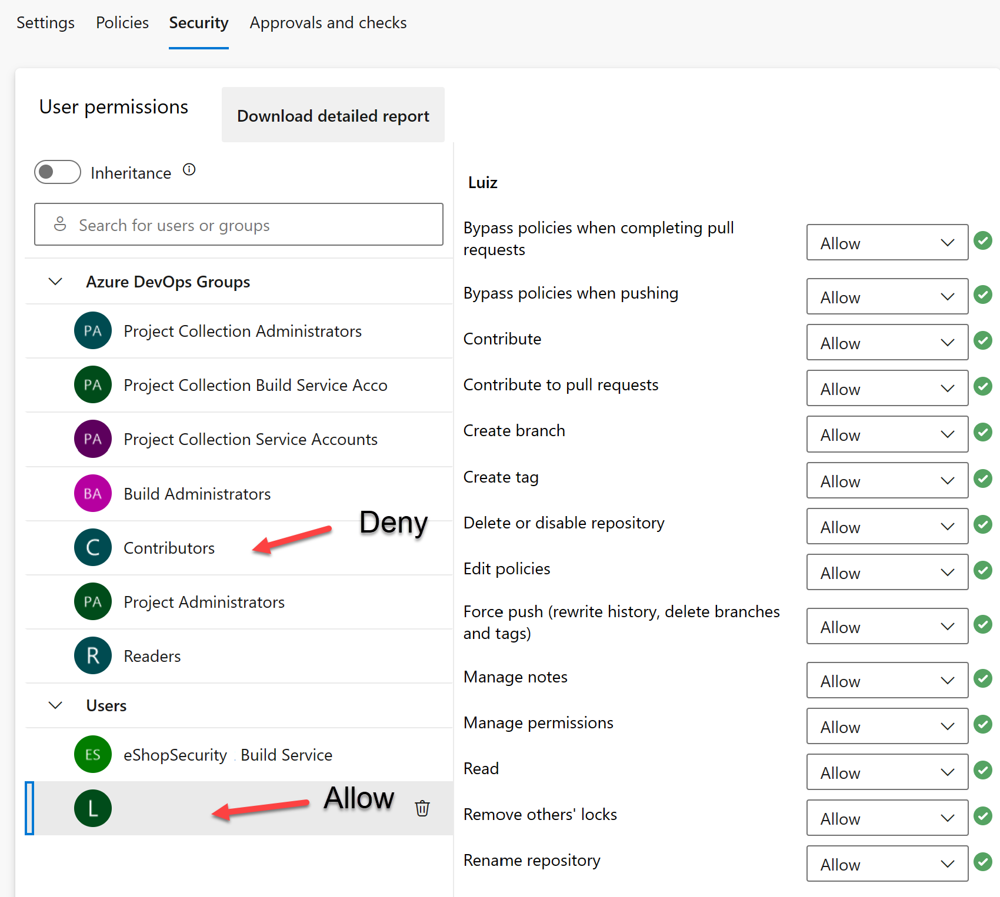

---
lab:
  title: Konfigurieren einer Projekt- und Repositorystruktur zur Unterstützung sicherer Pipelines
  module: 'Module 1: Configure a project and repository structure to support secure pipelines'
---

# Konfigurieren einer Projekt- und Repositorystruktur zur Unterstützung sicherer Pipelines

In diesem Lab lernen Sie, wie Sie eine Projekt- und Repositorystruktur zur Unterstützung sicherer Pipelines in Azure DevOps konfigurieren. In diesem Lab werden Best Practices zum Organisieren von Projekten und Repositorys, zum Zuweisen von Berechtigungen und zum Verwalten sicherer Dateien behandelt.

Diese Übung dauert ca. **30** Minuten.

## Vorbereitung

Sie benötigen ein Azure-Abonnement, eine Azure DevOps-Organisation und die eShopOnWeb-Anwendung, um den Laboren zu folgen.

- Führen Sie die Schritte aus, um Ihre Lab-Umgebung[ zu ](APL2001_M00_Validate_Lab_Environment.md)überprüfen.

## Anweisungen

### Übung 1: Konfigurieren einer sicheren Projektstruktur

In dieser Übung konfigurieren Sie eine sichere Projektstruktur, indem Sie ein neues Projekt erstellen und ihm Projektberechtigungen zuweisen. Das Trennen von Zuständigkeiten und Ressourcen in verschiedene Projekte oder Repositorys mit bestimmten Berechtigungen unterstützt die Sicherheit.

#### Aufgabe 1: Ein neues Projekt erstellen

1. Navigieren Sie zum Azure DevOps-Portal unter `https://dev.azure.com` und öffnen Sie Ihre Organisation.

1. Öffnen Sie die **Organisationseinstellungen** in der unteren linken Ecke des Portals und dann **Projekte** unter dem Abschnitt "Allgemein".

1. Wählen Sie die **Option "Neues Projekt** " aus, und verwenden Sie die folgenden Einstellungen:
   - name: **eShopSecurity**
   - Sichtbarkeit von Druckern
   - Erweitert: Versionssteuerung: **Git**
   - Erweitert: Arbeitsaufgabenprozess: **Scrum**

    

1. Wählen Sie **Erstellen** aus, um das neue Projekt zu erstellen.

1. Sie können jetzt zwischen den verschiedenen Teamprojekten wechseln, indem Sie in der oberen linken Ecke der Azure DevOps-Benutzeroberfläche auf das Dropdownmenü Projekt klicken.

    

Sie können Berechtigungen und Einstellungen für jedes Teamprojekt separat verwalten, indem Sie zum Menü Projekteinstellungen wechseln und das entsprechende Teamprojekt auswählen. Wenn Sie über mehrere Benutzer oder Teams verfügen, die an verschiedenen Projekten arbeiten, können Sie jedem Projekt auch separat Berechtigungen zuweisen.

#### Aufgabe 2: Erstellen eines neuen Repositorys und Zuweisen von Projektberechtigungen

1. Wählen Sie den Namen der Organisation in der oberen linken Ecke des Azure DevOps-Portals aus, und wählen Sie das neue **eShopSecurity-Projekt** aus.

1. Wählen Sie das Menüelement **Repos**.

1. Wählen Sie die **Schaltfläche "Initialisieren" aus, um das neue Repository zu initialisieren** , indem Sie die README.md Datei hinzufügen.

1. Öffnen Sie das **Menü "Project-Einstellungen** " in der unteren linken Ecke des Portals, und wählen Sie **"Repositorys** " im Abschnitt "Repositorys" aus.

1. Wählen Sie das neue **eShopSecurity-Repository** und dann die **Registerkarte "Sicherheit** " aus.

1. Entfernen Sie die Berechtigungen vom übergeordneten Element, indem Sie die **Umschaltfläche "Vererbung** " deaktivieren.

1. Wählen Sie die **Gruppe "Mitwirkende** " und dann die **Dropdownliste "Ablehnen** " für alle Berechtigungen mit Ausnahme von **"Lesen"** aus. Dadurch wird verhindert, dass alle Benutzer der Gruppe "Mitwirkende" auf das Repository zugreifen.

1. Wählen Sie Ihren Benutzer unter "Benutzer" und dann die **Schaltfläche "Zulassen** " aus, um alle Berechtigungen zuzulassen.

    

1. (Optional) Fügen Sie bestimmte Benutzergruppen oder Benutzer hinzu, die Sie Zugriff auf das Repository gewähren möchten, und führen Sie Pipelines aus dem eShopOnWeb-Projekt aus. Klicken Sie auf das Suchfeld, geben Sie den Namen der Gruppe ein, wählen Sie sie aus, und legen Sie dann die Berechtigungen fest, die Sie für die Gruppe oder den Benutzer zulassen oder verweigern möchten.

    > [!NOTE]
    > Stellen Sie sicher, dass Sie dieselbe Gruppe in Ihrem eShopOnWeb-Projekt haben. Dadurch können Sie Pipelines aus dem eShopOnWeb-Projekt ausführen und auf das Repository im eShopSecurity-Projekt zugreifen.

1. Ihre Änderungen werden automatisch gespeichert.

Jetzt können nur der Benutzer, dem Sie Berechtigungen zugewiesen haben, und die Administratoren können auf das Repository zugreifen. Dies ist nützlich, wenn Sie bestimmten Benutzern den Zugriff auf das Repository ermöglichen und Pipelines aus dem eShopOnWeb-Projekt ausführen möchten.

### Übung 2: Konfigurieren einer Pipeline- und Vorlagenstruktur zur Unterstützung sicherer Pipelines

#### Aufgabe 1: (Wenn erledigt, überspringen) Importieren und Ausführen der CI-Pipeline

1. Navigieren Sie zum Azure DevOps-Portal unter `https://dev.azure.com` und öffnen Sie Ihre Organisation.

1. Öffnen Sie das **eShopOnWeb-Projekt** in Azure DevOps.

1. Navigieren Sie in Azure Pipelines zu PipelinesPipelines.

1. Wählen Sie die Schaltfläche **Pipeline erstellen** aus.

1. Wählen Sie **Azure Repos Git** (YAML) aus.

1. Wählen Sie das **eShopOnWeb-Repository** aus.

1. Wählen Sie die Option **Vorhandene Azure Pipelines-YAML-Datei** aus.

1. Wählen Sie die **Datei "/.ado/eshoponweb-ci.yml**" und dann "Weiter"** aus**.

1. Klicken Sie auf die Schaltfläche **Ausführen**, um die Pipeline auszuführen.

1. Ihre Pipeline nimmt einen Namen auf der Grundlage des Projektnamens an. Benennen Sie sie um, um die Pipeline besser zu identifizieren.

1. Wechseln Sie zu **Pipelines > Pipelines** , und wählen Sie die zuletzt erstellte Pipeline aus. Wählen Sie die Auslassungspunkte (...“) und dann Umbenennen aus.

1. Nennen Sie es **eshoponweb-ci**, und wählen Sie "Speichern" aus****.

#### Erstellen Sie einen Dienstprinzipal, und konfigurieren Sie seinen Zugriff auf Azure-Ressourcen.

In dieser Aufgabe erstellen Sie einen Dienstprinzipal mithilfe der Azure CLI und der Dienst Verbinden ion in Azure DevOps, mit dem Sie Ressourcen in Ihrem Azure-Abonnement bereitstellen können.

1. Starten Sie auf Ihrem Labcomputer einen Webbrowser, navigieren Sie zum Azure-Portal, und melden Sie sich an. Verwenden Sie dabei die Anmeldeinformationen eines Benutzerkontos, das in dem Abonnement, das Sie in diesem Lab verwenden, über die Rolle „Besitzer“ und in dem Azure AD-Mandanten, der dem Azure-Abonnement zugeordnet ist, über die Rolle „Globaler Administrator“ verfügt.

1. Klicken Sie im Azure-Portal oben auf der Seite rechts neben dem Suchfeld auf die Schaltfläche [_] (Cloud Shell).

1. Wählen Sie bei Aufforderung zur Auswahl von **Bash** oder **PowerShell** die Option **Bash** aus.

   > [!NOTE]
   > Wenn Sie **Cloud Shell** zum ersten Mal starten und die Meldung **Für Sie wurde kein Speicher bereitgestellt.** angezeigt wird, wählen Sie das in diesem Lab verwendete Abonnement und anschließend **Speicher erstellen** aus.

1. Führen Sie in der **Bash-Eingabeaufforderung** im **Cloud Shell-Bereich** die folgenden Befehle aus, um die Werte der Azure-Abonnement-ID und der Abonnementnamenattribute abzurufen:

    ```bash
    az account show --query id --output tsv
    az account show --query name --output tsv
    ```

    > [!NOTE]
    > Kopieren Sie beide Werte in eine Textdatei. Sie werden sie später in diesem Lab benötigen.

1. Führen Sie in der **Bash-Eingabeaufforderung** im **Cloud Shell-Bereich** den folgenden Befehl aus, um einen Dienstprinzipal zu erstellen:

    ```bash
    az ad sp create-for-rbac --name myServicePrincipalName \
                         --role contributor \
                         --scopes /subscriptions/mySubscriptionID
    ```

    > [!NOTE]
    > Ersetzen Sie den **myServicePrincipalName** durch eine beliebige eindeutige Zeichenfolge, die aus Buchstaben und Ziffern besteht, z **. B. AzureDevOpsSP**, und **mySubscriptionID durch Ihre Azure subscriptionId** .

    > [!NOTE]
    > Der Befehl generiert eine JSON-Ausgabe. Speichern der Ausgabe in einer Textdatei Sie benötigen ihn später in diesem Lab.

1. Navigieren Sie als Nächstes zum Azure DevOps-Portal unter `https://dev.azure.com` und öffnen Sie Ihre Organisation.

1. Öffnen Sie das **eShopOnWeb-Projekt** , und wählen Sie **"Projekteinstellungen** " in der unteren linken Ecke des Portals aus.

1. Wählen Sie unter Pipelines die Option Dienstverbindungen und dann Dienstverbindung erstellen aus.

    

1. Wählen Sie im Bildschirm **Neue Dienstverbindung** die Option **Azure Resource Manager** und anschließend **Weiter** aus.

1. Wählen Sie **Dienstprinzipal (manuell)** und dann **Weiter** aus.

1. Füllen Sie die leeren Felder mit den informationen aus, die während der vorherigen Schritte gesammelt wurden:
    - Abonnement-ID oder -Name.
    - Dienstprinzipal-ID (oder clientId/AppId), Dienstprinzipalschlüssel (oder Kennwort) und TenantId.
    - Geben Sie unter **"Dienstverbindungsname****" Azure-Untere ein**. Auf diesen Namen wird in YAML-Pipelines verwiesen, wenn ein Azure DevOps Service Verbinden ion erforderlich ist, um mit Ihrem Azure-Abonnement zu kommunizieren.

        

1. Gewähren Sie allen Pipelines die Zugriffsberechtigung. Wählen Sie **Überprüfen und Speichern**.

    > [!NOTE]
    > Die **Option "Zugriff gewähren" für alle Pipelines** wird für Produktionsumgebungen nicht empfohlen. Es wird nur in dieser Übung verwendet, um die Konfiguration der Pipeline zu vereinfachen.

#### Aufgabe 3: (Wenn fertig, überspringen) Importieren und Ausführen der CD-Pipeline

1. Navigieren Sie in Azure Pipelines zu PipelinesPipelines.

1. Wählen Sie **die Schaltfläche "Neue Pipeline** " aus.

1. Wählen Sie **Azure Repos Git** (YAML) aus.

1. Wählen Sie das **eShopOnWeb-Repository** aus.

1. Wählen Sie die Option **Vorhandene Azure Pipelines-YAML-Datei** aus.

1. Wählen Sie die **Datei "/.ado/eshoponweb-cd-webapp-code.yml**" und dann "Weiter"** aus**.

1. Passen Sie in der YAML-Pipelinedefinition unter dem Abschnitt "Variablen" Folgendes an:
   - **AZ400-EWebShop-NAME** mit dem Namen Ihrer Vorliebe, **z. B. rg-eshoponweb-secure**.
   - **Standort** mit dem Namen der Azure-Region, die Sie bereitstellen möchten, **z. B. Southcentralus**.
   - Ersetzen Sie <yourSubscriptionId> durch Ihre Azure-Abonnement-ID.
   - **az400eshop-NAME**, mit einem Web-App-Namen, der mit einem globalen eindeutigen Namen bereitgestellt werden soll, **z. B. eshoponweb-lab-secure**.

1. Wählen Sie **Save** (Speichern) aus, um den Commit direkt im Mainbranch auszuführen, oder erstellen Sie einen neuen Branch für diesen Commit.

1. Wählen Sie erneut **Speichern und ausführen** aus.

    > [!NOTE]
    > Wenn Sie eine neue Verzweigung erstellen, müssen Sie eine Pullanforderung erstellen, um die Änderungen an der Standard Verzweigung zusammenzuführen.

1. Öffnen Sie die Pipeline. Wenn die Meldung "Diese Pipeline benötigt Die Berechtigung für den Zugriff auf eine Ressource benötigt, bevor diese Ausführung weiterhin auf WebApp bereitstellen kann" angezeigt wird, wählen Sie **"Ansicht**", **"Zulassen" und **"Zulassen**"** aus. Dies ist erforderlich, damit die Pipeline die Azure-App Dienstressource erstellen kann.

    

1. Die Bereitstellung kann einige Minuten dauern, warten Sie, bis die Pipeline ausgeführt wird. Die CD-Definition besteht aus den folgenden Aufgaben:
      - **Ressourcen**: Sie ist bereit, basierend auf dem Abschluss der CI-Pipeline automatisch auszulösen. Außerdem wird das Repository für die Bicep-Datei heruntergeladen.
      - **AzureResourceManagerTemplateDeployment**: Stellt die Azure Web App mithilfe der Bicep-Vorlage bereit.
1. Ihre Pipeline nimmt einen Namen auf der Grundlage des Projektnamens an. Benennen wir sie um, um die Pipeline besser zu identifizieren.

1. Wechseln Sie zu **Pipelines > Pipelines** , und wählen Sie die zuletzt erstellte Pipeline aus. Wählen Sie die Auslassungspunkte (...“) und dann Umbenennen aus.

1. Nennen Sie ihn **"eshoponweb-cd-webapp-code**", und wählen Sie "Speichern" aus****.

Jetzt sollten zwei Pipelines in Ihrem eShopOnWeb-Projekt ausgeführt werden.


#### Aufgabe 4: Verschieben der CD-Pipelinevariablen in eine YAML-Vorlage

In dieser Aufgabe erstellen Sie eine YAML-Vorlage zum Speichern der variablen, die in der CD-Pipeline verwendet werden. Auf diese Weise können Sie die Vorlage in anderen Pipelines wiederverwenden.

1. Wechseln Sie zu "Repos"** und dann **"** Dateien"**.

1. Erweitern Sie den **ADO-Ordner**, und wählen Sie "Neue Datei **" aus**.

1. Benennen Sie die Datei **"eshoponweb-secure-variables.yml**", und wählen Sie "Erstellen"** aus**.

1. Fügen Sie der neuen Datei den Variablenabschnitt hinzu, der in der CD-Pipeline verwendet wird. Die Datei sollte folgendermaßen aussehen:

    ```YAML
    variables:
      resource-group: 'rg-eshoponweb-secure'
      location: 'southcentralus' #name of the Azure region you want to deploy your resources
      templateFile: '.azure/bicep/webapp.bicep'
      subscriptionid: 'YOUR-SUBSCRIPTION-ID'
      azureserviceconnection: 'YOUR-AZURE-SERVICE-CONNECTION-NAME'
      webappname: 'eshoponweb-lab-secure'

    ```

    > [!IMPORTANT]
    > Ersetzen Sie die Werte der Variablen durch die Werte Ihrer Umgebung (Ressourcengruppe, Standort, Abonnement-ID, Azure-Dienstverbindung und Web App-Name).

1. Wählen Sie "Commit ausführen"**, fügen Sie **einen Kommentar hinzu, und wählen Sie **dann die Schaltfläche "Commit ausführen**" aus.

1. Öffnen Sie die **Pipelinedefinition "eshoponweb-cd-webapp-code.yml** ", und ersetzen Sie den Abschnitt "Variablen" durch Folgendes:

    ```YAML
    variables:
      - template: eshoponweb-secure-variables.yml
    ```

    > [!NOTE]
    > Wenn Sie einen anderen Pfad für die Vorlagendatei verwenden, müssen Sie den Pfad in der Pipelinedefinition aktualisieren.

1. Auswählen von , um die Pipeline zu speichern und auszuführen

Jetzt verfügen Sie über eine YAML-Vorlage mit den Variablen, die in der CD-Pipeline verwendet werden. Sie können diese Vorlage in anderen Pipelines in Szenarien wiederverwenden, in denen Sie dieselben Ressourcen bereitstellen müssen. Darüber hinaus kann Ihr Betriebsteam die Ressourcengruppe und den Speicherort steuern, an dem die Ressourcen bereitgestellt werden, und andere Informationen in Ihren Vorlagenwerten, und Sie müssen keine Änderungen an der Pipelinedefinition vornehmen.

#### Aufgabe 5: Verschieben der YAML-Vorlagen in ein separates Repository und Projekt

In dieser Aufgabe verschieben Sie die YAML-Vorlagen in ein separates Repository und Projekt.

1. Wechseln Sie in Ihrem eShopSecurity-Projekt zu **"Repos > Dateien**".

1. Erstellen Sie eine neue Datei namens **"eshoponweb-secure-variables.yml**".

1. Kopieren Sie den Inhalt der Datei **ado/eshoponweb-secure-variables.yml** aus dem eShopOnWeb-Repository in die neue Datei.

1. Führen Sie für die Änderungen einen Commit aus.

1. Öffnen Sie die **eshoponweb-cd-webapp-code.yml** Pipelinedefinition aus dem eShopOnWeb-Projekt.

1. Fügen Sie nun die folgende  im Ressourcenabschnitt hinzu:

    ```YAML
    resources:
      repositories:
        - repository: eShopSecurity
          type: git
          name: eShopSecurity/eShopSecurity #name of the project and repository

    ```

1. Ersetzen Sie den Abschnitt variables durch den folgenden Inhalt.

    ```YAML
    variables:
      - template: eshoponweb-secure-variables.yml@eShopSecurity #name of the template and repository
    ```

    

1. Auswählen von , um die Pipeline zu speichern und auszuführen Sie werden sehen, dass die Pipeline die YAML-Vorlage aus dem eShopSecurity-Repository verwendet.

    

Jetzt verfügen Sie über die YAML-Vorlagen in einem separaten Repository und Projekt. Sie können diese Vorlagen in anderen Pipelines in Szenarien wiederverwenden, in denen Sie dieselben Ressourcen bereitstellen müssen. Darüber hinaus kann Ihr Betriebsteam die Ressourcengruppe, den Standort, die Sicherheit und die Bereitstellung der Ressourcen sowie andere Informationen in Den Vorlagenwerten steuern, und Sie müssen keine Änderungen an der Pipelinedefinition vornehmen.

### Übung 2: Ausführen sauber up von Azure- und Azure DevOps-Ressourcen

In dieser Übung entfernen Sie Azure- und Azure DevOps-Ressourcen, die in dieser Übung erstellt wurden.

#### Aufgabe 1: Entfernen von Azure-Ressourcen

1. Öffnen Sie im Azure-Portal die erstellte Ressourcengruppe, und wählen Sie **"Ressourcengruppe** löschen" für alle erstellten Ressourcen in dieser Übung aus.

    

    > [!WARNING]
    > Denken Sie daran, alle neu erstellten Azure-Ressourcen zu entfernen, die Sie nicht mehr verwenden. Durch das Entfernen nicht verwendeter Ressourcen wird sichergestellt, dass keine unerwarteten Kosten anfallen.

#### Aufgabe 2: Entfernen von Azure DevOps-Pipelines

1. Navigieren Sie zum Azure DevOps-Portal unter `https://dev.azure.com` und öffnen Sie Ihre Organisation.

1. Öffnen Sie das **eShopOnWeb-Projekt** .

1. Navigieren Sie in Azure Pipelines zu PipelinesPipelines.

1. Wechseln Sie zu **Pipelines > Pipelines** , und entfernen Sie die vorhandenen Pipelines.

## Überprüfung

In diesem Lab lernen Sie, wie Sie eine Projekt- und Repositorystruktur zur Unterstützung sicherer Pipelines in Azure DevOps konfigurieren. Durch die effektive Verwaltung von Berechtigungen können Sie sicherstellen, dass die richtigen Benutzer Zugriff auf die benötigten Ressourcen haben, während Standard die Sicherheit und Integrität Ihrer DevOps-Pipelines und -Prozesse beibehalten.
