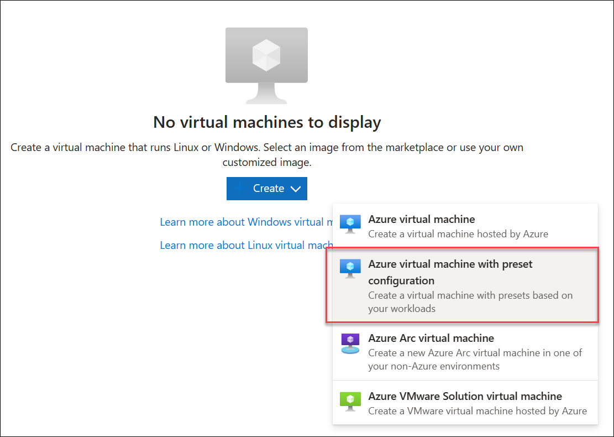

---
lab:
  title: Konfigurieren von Agents und Agentpools für sichere Pipelines
  module: 'Module 2: Configure secure access to pipeline resources'
---

# Konfigurieren von Agents und Agentpools für sichere Pipelines

In diesem Lab erfahren Sie, wie Sie Azure DevOps-Agents und -Agentpools konfigurieren und die Berechtigungen für diese Pools verwalten. Azure DevOps-Agentpools stellen die Ressourcen zum Ausführen Ihrer Build- und Releasepipelines bereit.

Diese Übung dauert ca. **25** Minuten.

## Vorbereitung

Sie benötigen ein Azure-Abonnement, eine Azure DevOps-Organisation und die eShopOnWeb-Anwendung, um den Labs zu folgen.

- Folgen Sie den Schritten, um Ihre [Lab-Umgebung zu überprüfen](APL2001_M00_Validate_Lab_Environment.md).

## Anweisungen

Sie erstellen Agents und konfigurieren selbst gehostete Agents mit Windows. Wenn Sie Agents unter Linux oder MacOS konfigurieren möchten, befolgen Sie die Anweisungen in der [Azure DevOps-Dokumentation](https://docs.microsoft.com/azure/devops/pipelines/agents/v2-linux).

Beachten Sie während der Konfiguration Folgendes:

- **Verwalten Sie separate Agents pro Projekt**: Jeder Agent kann nur an einen Pool gebunden werden. Das Teilen von Agentpools für verschiedene Projekte kann zwar Infrastrukturkosten sparen, es entsteht jedoch auch das Risiko eines Lateral Movements. Daher empfiehlt es sich, separate Agentpools mit dedizierten Agents für jedes Projekt zu haben, um Kreuzkontaminationen zu verhindern.
- **Verwenden von Konten mit geringen Berechtigungen zum Ausführen von Agents**: Das Ausführen eines Agents unter einer Identität mit direktem Zugriff auf Azure DevOps-Ressourcen kann ein Sicherheitsrisiko darstellen. Das Ausführen des Agents unter einem nicht privilegierten lokalen Konto wie Network Service ist ratsam, da dies das Risiko minimiert.
- **Achten Sie auf irreführende Gruppennamen**: Die Gruppe „Project Collection Service Accounts“ in Azure DevOps stellt ein potenzielles Sicherheitsrisiko dar. Das Ausführen von Agents mit einer Identität, die Teil dieser Gruppe ist und von Azure AD unterstützt wird, kann die Sicherheit Ihrer gesamten Azure DevOps-Organisation gefährden.
- **Vermeiden Sie besonders privilegierte Konten für selbst gehostete Agents**: Wenn Sie besonders privilegierte Konten verwenden, um selbst gehostete Agents auszuführen, insbesondere für den Zugriff auf Geheimnisse oder Produktionsumgebungen, kann Ihr System schwerwiegenden Bedrohungen ausgesetzt werden, wenn eine Pipeline kompromittiert ist.
- **Priorisieren von Sicherheit**: Verwenden Sie zum Schützen Ihrer Systeme das am wenigsten privilegierte Konto, um selbst gehostete Agents auszuführen. Sie könnten beispielsweise Ihr Computerkonto oder eine verwaltete Dienstidentität verwenden. Es ist auch ratsam, Azure Pipelines den Zugriff auf Geheimnisse und Umgebungen zu ermöglichen.

### Übung 1: Erstellen von Agents und Konfigurieren von Agentpools

In dieser Übung erstellen Sie einen virtuellen Azure-Computer (Virtual Machine, VM) und verwenden ihn, um einen Agent zu erstellen und Agentpools zu konfigurieren.

#### Aufgabe 1: Erstellen eines virtuellen Azure-Computers und Herstellen einer Verbindung mit diesem

1. Öffnen Sie das Azure-Portal unter `https://portal.azure.com` in Ihrem Browser. Wenn Sie dazu aufgefordert werden, melden Sie sich mithilfe eines Kontos mit der Rolle „Besitzer*in“ in Ihrem Azure-Abonnement an.

1. Geben Sie in das Textfeld **Nach Ressourcen, Diensten und Dokumenten suchen (G+/)** den Text **Virtuelle Computer** ein, und wählen Sie ihn aus der Dropdownliste aus.

1. Wählen Sie die Schaltfläche **Erstellen**.

1. Wählen Sie die Option **Virtueller Azure-Computer mit voreingestellter Konfiguration** aus.

    

1. Wählen Sie die **Dev/Test**-Umgebung als Workloadumgebung und **Universell** als Workloadtyp aus.

1. Wählen Sie die Schaltfläche **Mit Erstellen eines virtuellen Computers fortfahren** aus, führen Sie auf der Registerkarte **Grundlagen** die folgenden Aktionen aus, und wählen Sie dann die Option **Verwaltung** aus:

   | Einstellung | Aktion |
   | -- | -- |
   | Dropdownliste **Abonnement** | Wählen Sie Ihr Azure-Abonnement. |
   | Abschnitt **Ressourcengruppe** | Erstellen Sie eine neue Ressourcengruppe namens **rg-eshoponweb-agentpool**. |
   | **Name des virtuellen Computers** -Textfeld | Geben Sie den Namen Ihrer Einstellung ein, z. B. **eshoponweb-vm**. |
   | Dropdownliste **Region** | Wählen Sie dieselbe Azure-Region aus, die Sie zuvor in diesem Lab verwendet haben. |
   | **Verfügbarkeitsoptionen**-Dropdownliste | Wählen Sie die Option **Keine Infrastrukturredundanz erforderlich** aus. |
   | **Sicherheitstyp**-Dropdownliste | Wählen Sie mit der Option **Virtuelle Computer mit vertrauenswürdigem Start** aus. |
   | Dropdownliste **Image** | Wählen Sie **Windows Server 2022 Datacenter aus: Azure-Edition – x64 Gen2**-Image. |
   | **Größe**-Dropdownliste | Wählen Sie die günstigste **Standard**-Größe für Testzwecke aus. |
   | **Benutzername**-Textfeld | Benutzernamen Ihrer Wahl eingeben |
   | **Kennwort**-Textfeld | Kennwort Ihrer Wahl eingeben |
   | **Öffentliche Eingangsports**-Abschnitt | Wählen Sie **Ausgewählte Ports zulassen** aus. |
   | **Eingangsports auswählen**-Dropdownliste | Wählen Sie **RDP (3389)** aus. |

1. Aktivieren Sie auf der Registerkarte **Verwaltung** im Abschnitt **Identität** das Kontrollkästchen **Systemseitig zugewiesene verwaltete Identität aktivieren**, und wählen Sie dann **Überprüfen und Erstellen** aus:

1. Wählen Sie auf der Registerkarte **Überprüfen + erstellen** die Option **Erstellen** aus.

   > [!NOTE]
   > Warten Sie auf den Abschluss des Bereitstellungsvorgangs. Dieser Vorgang dauert etwa zwei Minuten.

1. Navigieren Sie im Azure-Portal zur Seite, auf der die Konfiguration des neu erstellten virtuellen Azure-Computers angezeigt wird. 

1. Wählen Sie zunächst auf der Seite „Virtueller Azure-Computer“ **Verbinden**, dann im Dropdownmenü **Verbinden** und anschließend **RDP-Datei herunterladen** aus, und verwenden Sie die heruntergeladene RDP-Datei, um eine Remotedesktopsitzung auf dem Betriebssystem einzurichten, das auf dem virtuellen Azure-Computer ausgeführt wird.

#### Aufgabe 2: Agent-Pool erstellen

1. Starten Sie in der Remotedesktopsitzung auf dem virtuellen Azure-Computer den Microsoft Edge-Webbrowser.

1. Navigieren Sie im Webbrowser zum Azure DevOps-Portal unter `https://dev.azure.com`, und melden Sie sich an, um auf Ihre Organisation zuzugreifen.

1. Öffnen Sie das Projekt **eShopOnWeb** , und wählen Sie die Option **Projekteinstellungen** im linken unteren Menü aus.

1. Wählen Sie in **Pipelines > Agentpools** die Schaltfläche **Pool hinzufügen** aus.

1. Wählen Sie den **selbst gehosteten** Pooltyp aus.

1. Geben Sie einen Namen für den Agentpool an, z. B. **eShopOnWebSelfPool**, und fügen Sie eine optionale Beschreibung hinzu.

1. Lassen Sie die Option **Allen Pipelines die Zugriffsberechtigung gewähren** deaktiviert.

   

1. Klicken Sie auf die Schaltfläche **Erstellen**, um den Agentpool zu erstellen.

#### Aufgabe 3: Agent-Installationsdateien herunterladen und extrahieren

1. Wählen Sie im Azure DevOps-Portal den neu erstellten Agentpool und dann die Registerkarte **Agents** aus.

1. Wählen Sie die Schaltfläche **Neuer Agent** und dann die Schaltfläche **Herunterladen** aus dem **Download-Agent** im neuen Popupfenster aus.

   > [!NOTE]
   > Befolgen Sie die Installationsanweisungen, um den Agent zu installieren.

1. Starten Sie eine PowerShell-Sitzung, und führen Sie die folgenden Befehle aus, um einen Ordner namens **Agent** zu erstellen.

   ```powershell
   mkdir agent ; cd agent        
   ```

   > [!NOTE]
   > Stellen Sie sicher, dass Sie sich im Stammordner Ihres Benutzerprofils oder in dem Ordner befinden, in dem Sie den Agent installieren möchten.

1. Führen Sie den folgenden Befehl aus, um den Inhalt der heruntergeladenen Agent-Installationsdateien zu extrahieren:

   ```powershell
   Add-Type -AssemblyName System.IO.Compression.FileSystem ; [System.IO.Compression.ZipFile]::ExtractToDirectory("$HOME\Downloads\vsts-agent-win-x64-3.232.0.zip", "$PWD")
   ```

   > [!NOTE]
   > Wenn Sie den Agent an einen anderen Speicherort heruntergeladen haben (oder die heruntergeladene Version unterschiedlich ist), passen Sie den obigen Befehl entsprechend an.

#### Aufgabe 4: PAT-Token erstellen

> [!NOTE]
> Bevor Sie den Agent konfigurieren, müssen Sie ein PAT-Token erstellen (es sei denn, Sie verfügen über ein vorhandenes Token). Gehen Sie zum Erstellen eines PAT-Tokens wie folgt vor:

1. Öffnen Sie in der Remotedesktopsitzung auf dem virtuellen Azure-Computer ein anderes Browserfenster, navigieren Sie zum Azure DevOps-Portal unter `https://dev.azure.com`, und greifen Sie auf Ihre Organisation zu.

1. Wählen Sie **Benutzereinstellungen** aus dem rechten oberen Menü (direkt links neben dem Avatarsymbol des Benutzers bzw. der Benutzerin) aus.

1. Wählen Sie das Menüelement **Persönliche Zugriffstoken** aus.

   

1. Wählen Sie die Schaltfläche **Neues Token** aus.

1. Geben Sie einen Namen für das Token an, z. B. ** eShopOnWebToken**.

1. Wählen Sie die Azure DevOps-Organisation aus, für die Sie das Token verwenden möchten.

1. Legen Sie das Ablaufdatum für das Token fest (wird nur zum Konfigurieren des Agents verwendet).

1. Wählen Sie den benutzerdefinierten Bereich aus.

1. Wählen Sie diese Option aus, um alle Bereiche anzuzeigen.

1. Wählen Sie den Bereich **Agentpools (Lesen und Verwalten)** aus.

1. Wählen Sie die Schaltfläche **Erstellen** aus, um das Token zu erstellen.

1. Kopieren Sie den Tokenwert, und speichern Sie ihn an einem sicheren Ort (Sie werden ihn nicht mehr sehen können. Sie können das Token nur erneut generieren).

   

   > [!IMPORTANT]
   > Verwenden Sie die Option mit den geringsten Rechten, **Agentpools (Lesen und Verwalten)**, nur für die Agentkonfiguration. Stellen Sie außerdem sicher, dass Sie das Mindestablaufdatum für das Token festlegen, wenn dies der einzige Zweck des Tokens ist. Sie können ein weiteres Token mit den gleichen Rechten erstellen, wenn Sie den Agent erneut konfigurieren müssen.

#### Aufgabe 5: Konfigurieren des Agents

1. Wechseln Sie in der Remotedesktopsitzung auf einem virtuellen Azure-Computer zurück zum PowerShell-Fenster. Ändern Sie bei Bedarf das aktuelle Verzeichnis in das Verzeichnis, in das Sie die Agent-Installationsdateien weiter oben in dieser Übung extrahiert haben. 

1. Rufen Sie den folgenden Befehl auf, um Ihren Agent so zu konfigurieren, dass er unbeaufsichtigt ausgeführt wird:

   ```powershell
   .\config.cmd
   ```

   > [!NOTE]
   > Wenn Sie den Agent interaktiv ausführen möchten, verwenden Sie stattdessen `.\run.cmd`. 

1. Führen Sie zum Konfigurieren des Agents die folgenden Aktionen aus, wenn Sie dazu aufgefordert werden:

   - Geben Sie die URL der Azure DevOps-Organisation (**Server-URL**) im Format `https://dev.azure.com/`{Name Ihrer Organisation} ein.
   - Übernehmen Sie den Standardauthentifizierungstyp. (**PAT**).
   - Geben Sie den Wert des PAT-Tokens ein, das Sie im vorherigen Schritt erstellt haben.
   - Geben Sie den Namen des Agentpools **eShopOnWebSelfPool** ein, den Sie zuvor in dieser Übung erstellt haben.
   - Geben Sie den Agentnamen **eShopOnWebSelfAgent** ein.
   - Übernehmen Sie den standardmäßigen Arbeitsordner des Agents (_work).
   - Geben Sie **Y** ein, um den Agent so zu konfigurieren, dass er als Dienst ausgeführt wird.
   - Geben Sie **Y** ein, um SERVICE_SID_TYPE_UNRESTRICTED für den Agentdienst zu aktivieren.
   - Geben Sie **NT AUTHORITY\SYSTEM** ein, um den Sicherheitskontext für den Dienst festzulegen.

   > [!IMPORTANT]
   > Im Allgemeinen sollten Sie beim Konfigurieren des Dienstsicherheitskontexts dem Prinzip der geringsten Rechte folgen.

   - Übernehmen Sie die Standardoption (**N**), damit der Dienst unmittelbar nach Abschluss der Konfiguration gestartet werden kann.

   

1. Überprüfen Sie den Agentstatus, indem Sie zum Webbrowser wechseln, in dem das Azure DevOps-Portal angezeigt wird, zum Agentpool navigieren und auf die Registerkarte **Agents** klicken. Ihnen sollte der neue Agent in der Liste angezeigt werden.

   

   > [!NOTE]
   > Weitere Informationen zu Windows-Agents finden Sie unter: [Selbstgehostete Windows-Agents](https://learn.microsoft.com/azure/devops/pipelines/agents/windows-agent)

   > [!IMPORTANT]
   > Damit der Agent Azure-Ressourcen aus den Azure DevOps-Pipelines erstellen und bereitstellen kann (dies durchlaufen Sie in den kommenden Labs), müssen Sie Azure CLI innerhalb des Betriebssystems des virtuellen Computers installieren, der den Agent hostet.

1. Starten Sie einen Webbrowser, und navigieren Sie zu der Seite [Installieren der Azure CLI unter Windows](https://learn.microsoft.com/en-us/cli/azure/install-azure-cli-windows?tabs=azure-cli#install-or-update).

1. Laden Sie die Azure-Befehlszeilenschnittstelle herunterladen, und installieren Sie sie. 

1. Navigieren Sie im Webbrowser zu der Seite „Microsoft .NET 7.0 SDK-Installationsprogramm“ unter `https://dotnet.microsoft.com/en-us/download/dotnet/thank-you/sdk-7.0.404-windows-x64-installer`.

1. Laden Sie Microsoft .NET 7.0 SDK herunter, und installieren Sie es.

### Übung 2: Agentpoolsicherheit erstellen und konfigurieren

In dieser Übung konfigurieren Sie die Sicherheit für den Agentpool.

#### Aufgabe 1: Erstellen einer neuen Sicherheitsgruppe

1. Wählen Sie in der Remotedesktopsitzung auf dem virtuellen Azure-Computer im Webbrowser, in dem das Azure DevOps-Portal angezeigt wird, im Bereich **Project-Einstellungen** im Abschnitt **Allgemein** **Berechtigungen** aus.

1. Wählen Sie die Schaltfläche **Neue Gruppe** aus.

1. Geben Sie einen Namen für die Gruppe an, z. B. **eShopOnWeb-Sicherheitsgruppe**.

1. Wählen Sie die Schaltfläche **Erstellen** aus, um die Gruppe zu erstellen.

   

#### Aufgabe 2: Konfigurieren der Sicherheitsgruppe

1. Wählen Sie im Webbrowserfenster, in dem das Azure Devops-Portal angezeigt wird, die neue Gruppe aus, um die Registerkarte **Berechtigungen** anzuzeigen.

1. Verweigern Sie unnötige Berechtigungen für die Gruppe, z. B. **Teamprojekt umbenennen**, **Arbeitselemente dauerhaft löschen** oder andere Berechtigungen, die die Gruppe nicht haben soll, da davon ausgegangen wird, dass sie nur für den Agentpool verwendet wird.

   

   > [!IMPORTANT]
   > Wenn Sie Berechtigungen beibehalten, über die die Gruppe nicht verfügen soll, können Skripts oder Aufgaben, die auf dem Agent ausgeführt werden, die Gruppenberechtigungen verwenden, um ungewünschte Aktionen auszuführen.

#### Aufgabe 3: Agentpoolberechtigungen verwalten

In dieser Aufgabe verwalten Sie Berechtigungen für den Agentpool.

1. Wählen Sie im Webbrowserfenster, in dem das Azure Devops-Portal angezeigt wird, in den **Projekteinstellungen** des **eShopOnWeb**-Projekts im Abschnitt **Pipelines** die Option **Agentpools** aus.

1. Wählen Sie den Agentpool **eShopOnWebSelfPool** aus.

1. Wählen Sie in der Detailansicht des Agentpools die Registerkarte **Sicherheit** aus.

1. Wählen Sie die Schaltfläche **Hinzufügen** aus, und fügen Sie die neue Gruppe **eShopOnWeb-Sicherheitsgruppe** zu den Benutzerberechtigungen des Agentpools hinzu.

1. Wählen Sie die entsprechende Rolle für den Benutzer oder die Gruppe aus, z. B. Agentpoolleser, Benutzer oder Administrator. Wählen Sie in diesem Fall **Benutzer** aus.

1. Wählen Sie **Hinzufügen** aus, um die Berechtigungen anzuwenden.

   

Jetzt können Sie den Agentpool in Ihren Pipelines sicher verwenden. Weitere Informationen zu Agentpools finden Sie unter: [Agentpools](https://learn.microsoft.com/azure/devops/pipelines/agents/pools-queues).

### Übung 4: Bereinigung von Azure- und Azure DevOps-Ressourcen durchführen

In dieser Übung bereinigen Sie nach der Durchführung des Labs einige Azure DevOps-Ressourcen, die in diesem Lab erstellt wurden.

#### Aufgabe 1: Virtuellen Azure-Computer beenden und seine Zuordnung aufheben

> [!NOTE]
> Sie verwenden den virtuellen Azure-Computer, den Sie in diesem Lab erstellt haben, im nächsten Lab. Statt ihn zu löschen, beenden Sie ihn und heben Sie seine Zuordnung auf, um die Berechnungsgebühren zu beseitigen.

1. Navigieren Sie im Azure-Portal zu der Seite, auf der der virtuelle Azure-Computer **eshoponweb-vm** angezeigt wird, den Sie in diesem Lab bereitgestellt haben

1. Wählen Sie auf der Seite des virtuellen Azure-Computers **eshoponweb-vm** auf der Symbolleiste die Option **Beenden** aus, um ihn zu beenden und seine Zuordnung aufzuheben.

#### Aufgabe 2: Azure DevOps-Ressourcen entfernen

> [!NOTE]
> Sie verwenden den selbst gehosteten Agent, den Sie in diesem Lab erstellt haben, im nächsten Lab. Statt ihn zu löschen, widerrufen Sie nur das zum Konfigurieren verwendete persönliche Zugriffstoken. Dadurch wird nicht verhindert, dass er später ausgeführt wird.

1. Wählen Sie im Azure DevOps-Portal die Option **Benutzereinstellungen** aus dem rechten oberen Menü (direkt links neben dem Avatarsymbol des Benutzers bzw. der Benutzerin) aus.

1. Wählen Sie das Menüelement **Persönliche Zugriffstoken** aus.

   

1. Wählen Sie den Eintrag **eShopOnWebToken** aus. 

1. Wählen Sie **Widerrufen** aus, und wählen Sie, wenn Sie zur Bestätigung aufgefordert werden, **Widerrufen** erneut aus.

## Überprüfung

In diesem Lab haben Sie erfahren, wie Sie Azure DevOps selbstgehostete Agents und Agentpools konfigurieren und die Berechtigungen für diese Pools verwalten. Durch die effektive Verwaltung von Berechtigungen können Sie sicherstellen, dass die richtigen Benutzer Zugriff auf die benötigten Ressourcen haben, während die Sicherheit und Integrität Ihrer DevOps-Prozesse beibehalten werden.
