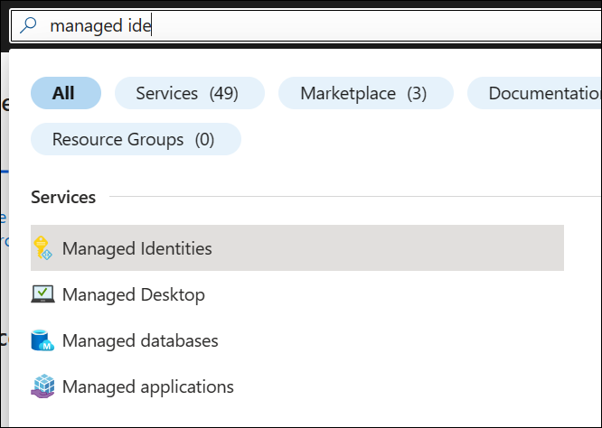

---
lab:
  title: 'Lab: Verwalten von Identitäten für Projekte und Pipelines'
  module: 'Module 2: Manage identity for projects, pipelines, and agents'
---

# Lab: Verwalten von Identitäten für Projekte und Pipelines

Verwaltete Identitäten bieten eine sichere Methode zum Steuern des Zugriffs auf Azure-Ressourcen. Azure verarbeitet diese Identitäten automatisch, sodass Sie den Zugriff auf Dienste überprüfen können, die mit der Azure AD-Authentifizierung kompatibel sind. Dies bedeutet, dass Sie keine Anmeldeinformationen in Ihren Code einbetten müssen, um die Sicherheit zu erhöhen. In Azure DevOps können verwaltete Identitäten Azure-Ressourcen innerhalb Ihrer selbstgehosteten Agents authentifizieren, wodurch die Zugriffssteuerung vereinfacht wird, ohne die Sicherheit zu beeinträchtigen.

Erstellen Sie in diesem Lab eine verwaltete Identität zur Verwendung in Ihren YAML-Pipelines mithilfe von Azure DevOps mit selbstgehosteten Agents und einer verwalteten Identität.

Diese Übung dauert ca. **30** Minuten.

## Vorbereitung

Sie benötigen ein Azure-Abonnement, eine Azure DevOps-Organisation und die eShopOnWeb-Anwendung, um den Laboren zu folgen.

- Führen Sie die Schritte aus, um Ihre Lab-Umgebung[ zu ](APL2001_M00_Validate_Lab_Environment.md)überprüfen.

- Vergewissern Sie sich, dass Sie über ein Microsoft-Konto oder ein Azure AD-Konto mit der Rolle „Mitwirkender“ oder „Besitzer“ im Azure-Abonnement verfügen. Ausführliche Informationen finden Sie in den Artikeln zum [Auflisten von Azure-Rollenzuweisungen mithilfe des Azure-Portals](https://learn.microsoft.com/azure/role-based-access-control/role-assignments-list-portal) und [Anzeigen und Zuweisen von Administratorrollen in Azure Active Directory](https://learn.microsoft.com/azure/active-directory/roles/manage-roles-portal).

## Anweisungen

### Übung 1: Importieren und Ausführen von CI/CD-Pipelines

In dieser Übung importieren und ausführen Sie die CI-Pipeline, konfigurieren die Dienstverbindung mit Ihrem Azure-Abonnement und importieren und führen dann die CD-Pipeline aus.

#### Aufgabe 1: (Wenn erledigt, überspringen) Importieren und Ausführen der CI-Pipeline

Beginnen wir mit dem Importieren der CI-Pipeline mit dem Namen [eshoponweb-ci.yml](https://github.com/MicrosoftLearning/eShopOnWeb/blob/main/.ado/eshoponweb-ci.yml).

1. Navigieren Sie zum Azure DevOps-Portal unter `https://dev.azure.com` und öffnen Sie Ihre Organisation.

1. Öffnen Sie das **eShopOnWeb-Projekt** .

1. Navigieren Sie in Azure Pipelines zu PipelinesPipelines.

1. Wählen Sie **die Schaltfläche "Neue Pipeline"** aus.

1. Wählen Sie **Azure Repos Git** (YAML) aus.

1. Wählen Sie das **eShopOnWeb-Repository** aus.

1. Wählen Sie die Option **Vorhandene Azure Pipelines-YAML-Datei** aus.

1. Wählen Sie die **Datei "/.ado/eshoponweb-ci.yml** " aus, und klicken Sie dann auf **"Weiter"**.

1. Klicken Sie auf die Schaltfläche **Ausführen**, um die Pipeline auszuführen.

    > [!NOTE]
    > Ihre Pipeline nimmt einen Namen auf der Grundlage des Projektnamens an. Benennen Sie sie um, um die Pipeline besser zu identifizieren.

1. Wechseln Sie zu **Pipelines > Pipelines**, wählen Sie die zuletzt erstellte Pipeline aus, wählen Sie die Auslassungspunkte und dann **die Option "Umbenennen/Verschieben** " aus.

1. Nennen Sie es **eshoponweb-ci**, und wählen Sie "Speichern" aus****.

#### Wählen Sie auf der Taskleiste Verbindungen verwalten:

Sie können eine Verbindung zwischen Azure Pipelines und externen Diensten und Remotediensten herstellen, um Aufgaben in einem Auftrag auszuführen.

In dieser Aufgabe erstellen Sie einen Dienstprinzipal mithilfe der Azure CLI, der Azure DevOps zulässt:

- Bereitstellen von Ressourcen in einem Azure-Abonnement
- Bereitstellen der eShopOnWeb-Anwendung

> [!NOTE]
> Wenn Sie bereits über einen Dienstprinzipal und eine Dienstverbindung mit Ihrem Azure-Abonnement namens **Azure-Subs** verfügen, können Sie direkt mit der nächsten Aufgabe fortfahren.

Sie benötigen einen Dienstprinzipal, um Azure-Ressourcen aus Azure-Pipelines bereitzustellen.

Ein Dienstprinzipal wird automatisch von Azure Pipeline erstellt, wenn Sie eine Verbindung mit einem Azure-Abonnement innerhalb einer Pipelinedefinition herstellen oder wenn Sie eine neue Dienstverbindung über die Seite mit den Projekteinstellungen (automatische Option) erstellen. Sie können den Dienstprinzipal auch manuell über das Portal erstellen oder Azure CLI verwenden und es für alle Projekte wiederverwenden.

1. Starten Sie auf Ihrem Labcomputer einen Webbrowser, navigieren Sie zum Azure-Portal, und melden Sie sich an. Verwenden Sie dabei die Anmeldeinformationen eines Benutzerkontos, das in dem Abonnement, das Sie in diesem Lab verwenden, über die Rolle „Besitzer“ und in dem Azure AD-Mandanten, der dem Azure-Abonnement zugeordnet ist, über die Rolle „Globaler Administrator“ verfügt.

1. Klicken Sie im Azure-Portal oben auf der Seite rechts neben dem Suchfeld auf die Schaltfläche [_] (Cloud Shell).

1. Wählen Sie bei Aufforderung zur Auswahl von **Bash** oder **PowerShell** die Option **Bash** aus.

   > [!NOTE]
   > Wenn Sie **Cloud Shell** zum ersten Mal starten und die Meldung **Für Sie wurde kein Speicher bereitgestellt.** angezeigt wird, wählen Sie das in diesem Lab verwendete Abonnement und anschließend **Speicher erstellen** aus.

1. Führen Sie in der **Bash-Eingabeaufforderung** im **Cloud Shell-Bereich** die folgenden Befehle aus, um die Werte des Azure-Abonnement-ID-Attributs abzurufen:

    ```sh
    subscriptionName=$(az account show --query name --output tsv)
    subscriptionId=$(az account show --query id --output tsv)
    echo $subscriptionName
    echo $subscriptionId
    ```

    > [!NOTE]
    > Kopieren Sie beide Werte in eine Textdatei. Sie werden sie später in diesem Lab benötigen.

1. Führen Sie in der **Bash-Eingabeaufforderung** im **Cloud Shell-Bereich** den folgenden Befehl aus, um einen Dienstprinzipal zu erstellen:

    ```sh
    az ad sp create-for-rbac --name sp-eshoponweb-azdo --role contributor --scopes /subscriptions/$subscriptionId
    ```

    > [!NOTE]
    > Der Befehl generiert eine JSON-Ausgabe. Speichern der Ausgabe in einer Textdatei Sie benötigen ihn später in diesem Lab.

1. um zum Azure DevOps-Projekt zu navigieren. Klicken Sie auf **Project Einstellungen > Service Verbinden ions (unter Pipelines)** und **"New Service Verbinden ion"**.

1. Wählen Sie im Bildschirm **Neue Dienstverbindung** die Option **Azure Resource Manager** und anschließend **Weiter** aus.

1. Wählen Sie **Dienstprinzipal (manuell)** und dann **Weiter** aus.

1. Füllen Sie die leeren Felder mit den informationen aus, die während der vorherigen Schritte gesammelt wurden:
    - Abonnement-ID oder -Name.
    - Dienstprinzipal-ID (oder ClientId), Schlüssel (oder Kennwort) und TenantId.
    - Geben Sie unter **"Dienstverbindungsname****" Azure-Untere ein**. Auf diesen Namen wird in YAML-Pipelines verwiesen, wenn ein Azure DevOps Service Verbinden ion erforderlich ist, um mit Ihrem Azure-Abonnement zu kommunizieren.

1. Wählen Sie **Überprüfen und Speichern**.

#### Übung 3: Importieren und Ausführen der CD-Pipeline

Importieren Sie nun die CD-Pipeline mit dem Namen ["eshoponweb-cd-webapp-code.yml](https://github.com/MicrosoftLearning/eShopOnWeb/blob/main/.ado/eshoponweb-cd-webapp-code.yml)".

1. Navigieren Sie in Azure Pipelines zu PipelinesPipelines.

1. Klicken Sie auf die Schaltfläche Neue Pipeline**.

1. Wählen Sie **Azure Repos Git** (YAML) aus.

1. Wählen Sie das **eShopOnWeb-Repository** aus.

1. Wählen Sie die Option **Vorhandene Azure Pipelines-YAML-Datei** aus.

1. Wählen Sie die **Datei "/.ado/eshoponweb-cd-webapp-code.yml**" und dann "Weiter"** aus**.

1. Legen Sie in der YAML-Pipelinedefinition den Abschnitt "Variablen" auf Folgendes fest:

    ```YAML
    variables:
      resource-group: 'AZ400-EWebShop-NAME'
      location: 'westeurope'
      templateFile: '.azure/bicep/webapp.bicep'
      subscriptionid: 'YOUR-SUBSCRIPTION-ID'
      azureserviceconnection: 'azure subs'
      webappname: 'az400-webapp-NAME'
    ```

1. Ersetze die Platzhalter im obigen Befehl durch die folgenden Werte.

   - **AZ400-EWebShop-NAME** mit dem Namen Ihrer Vorliebe, **z. B. rg-eshoponweb**.
   - **Standort** mit dem Namen der Azure-Region, die Sie bereitstellen möchten, **z. B. Southcentralus**.
   - Ersetzen Sie <yourSubscriptionId> durch Ihre Azure-Abonnement-ID.
   - **az400-webapp-NAME**, mit einem Web-App-Namen, der mit einem globalen eindeutigen Namen bereitgestellt werden soll, **z. B. eshoponweb-lab-YOURNAME**.

1. Wenn vorhanden, entfernen Sie im Abschnitt "Ressourcen" die folgenden Einträge:

    ```YAML
    repositories:
      - repository: eShopSecurity
        type: git
        name: eShopSecurity/eShopSecurity #name of the project and repository
    ```

1. Wählen Sie **Save** (Speichern) aus, um den Commit direkt im Mainbranch auszuführen, oder erstellen Sie einen neuen Branch für diesen Commit.

1. Wählen Sie erneut **Speichern und ausführen** aus.

    > [!NOTE]
    > Wenn Sie eine neue Verzweigung erstellen, müssen Sie eine Pullanforderung erstellen, um die Änderungen an der Standard Verzweigung zusammenzuführen.

1. Öffnen Sie die Pipeline. Wenn die Meldung "Diese Pipeline benötigt die Berechtigung für den Zugriff auf eine Ressource, bevor diese Ausführung weiterhin auf WebApp bereitstellen kann", selet **View**, **Permit** und **Permit** erneut angezeigt wird. Dies ist erforderlich, damit die Pipeline die Azure-App Dienstressource erstellen kann.

    

1. Die Bereitstellung kann einige Minuten dauern, warten Sie, bis die Pipeline ausgeführt wird. Die CD-Definition besteht aus den folgenden Aufgaben:
      - **Ressourcen**: Sie ist bereit, basierend auf dem Abschluss der CI-Pipeline automatisch auszulösen. Außerdem wird das Repository für die Bicep-Datei heruntergeladen.
      - **AzureResourceManagerTemplateDeployment**: Stellt die Azure Web App mithilfe der Bicep-Vorlage bereit.

1. Ihre Pipeline nimmt einen Namen auf der Grundlage des Projektnamens an. **Benennen** wir sie um, um die Pipeline besser zu identifizieren.

1. Wechseln Sie zu **Pipelines > Pipelines**, wählen Sie die zuletzt erstellte Pipeline aus, wählen Sie die Auslassungspunkte und dann **die Option "Umbenennen/Verschieben** " aus.

1. Nennen Sie ihn **"eshoponweb-cd-webapp-code**", und wählen Sie dann "Speichern"** aus**.

### Übung 2: Erstellen einer verwalteten Identität für die Dienstverbindung

In dieser Übung erstellen Sie eine verwaltete Identität und erstellen dann eine neue Dienstverbindung, um sie in den CI/CD-Pipelines zu verwenden.

#### Erstellen einer vom System verwalteten Identität

1. Öffnen Sie das Azure-Portalin Ihrem Browser.

1. Geben Sie im **Feld "Ressourcen suchen", "Dienste und Dokumente" (G+/) "Verwaltete Identitäten **"** ein, und wählen Sie sie aus der Dropdownliste **aus.

    

1. Wählen Sie die zuvor erstellte verwaltete Identität aus.

1. Füllen Sie im **Bereich "Verwaltete Identität** erstellen" die erforderlichen Informationen aus:
   - **Abonnement mit Ihrem Azure-Abonnement** .
   - **Ressourcengruppe**: Eine neue oder vorhandene Ressourcengruppe.
   - **Region** mit der Region in der Nähe Ihres Standorts oder verfügbar für Ihre Ressourcen.
   - **Name** mit dem Namen "Managed Identity" Ihrer Einstellung, **z. B. "eshoponweb-mi**".

    

    > [!NOTE]
    > Wenn Sie nicht über eine Ressourcengruppe verfügen, können Sie eine erstellen, indem Sie auf den **Link "Neuen Erstellen"** klicken.

1. Klicken Sie auf **Überprüfen und erstellen** und dann auf **Erstellen**.

#### Zuweisen von Berechtigungen für die verwaltete Identität

Als Nächstes müssen Sie der Ressourcengruppe und den App-Diensten die Berechtigungen "Verwaltete Identität" zuweisen.

1. Navigieren Sie im Azure-Portal zu der von Ihnen erstellten benutzerseitig zugewiesenen verwalteten Identität.

1. Wählen Sie die **Registerkarte "Azure-Rollenzuweisungen** " im Menü "Let side" aus.

1. Wählen Sie die **Schaltfläche "Rollenzuweisung** hinzufügen" aus, und führen Sie die folgenden Aktionen aus:

    | Einstellung | Aktion |
    | -- | -- |
    | Öffnen Sie die Dropdownliste. | Wählen Sie **Ressourcengruppe** aus. |
    | Dropdownliste **Abonnement** | Wählen Sie Ihr Azure-Abonnement aus. |
    | Dropdownliste **Ressourcengruppe** | Verwenden Sie die vorhandene Ressourcengruppe. |
    | Dropdownliste der Tabellen | Wählen Sie die Rolle **Mitwirkender** aus. |

1. Wählen Sie die Schaltfläche **Speichern** aus.

    

### Übung 3: Erstellen eines neuen virtuellen Azure-Computers mit selbst gehostetem Agent und verwalteter Identität und Aktualisieren der CI-Pipeline

In dieser Übung erstellen Sie einen neuen virtuellen Azure-Computer mit dem selbst gehosteten Agent und der verwalteten Identität, die Sie in der vorherigen Übung erstellt haben. Anschließend aktualisieren Sie die CI-Pipeline, um den neuen virtuellen Azure-Computer zu verwenden.

#### So erstellen Sie einen virtuellen Computer in Azure

1. Öffnen Sie das Azure-Portalin Ihrem Browser.

1. Geben Sie im **Feld "Ressourcen suchen", "Dienste und Dokumente " (G+/)** " **Virtuelle Computer** " ein, und wählen Sie sie aus der Dropdownliste aus.

1. Wählen Sie die Schaltfläche **Erstellen**.

1. Klicken Sie unter „Virtuelle Computer“ auf **+ Hinzufügen > + Mit vordefinierter Konfiguration starten**.

    

1. Wählen Sie " **Dev/Test** " als Arbeitsauslastungsumgebung und den **allgemeinen Zweck** als Workloadtyp aus.

1. Wählen Sie die **Schaltfläche "Weiter" aus, um eine VM** zu erstellen, führen Sie auf der **Registerkarte "Grundlagen**" die folgenden Aktionen aus, und wählen Sie dann die Registerkarte "Verwaltung **" aus**:

    | Einstellung | Aktion |
    | -- | -- |
    | Dropdownliste **Abonnement** | Wählen Sie Ihr Azure-Abonnement aus. |
    | Abschnitt **Ressourcengruppe** | Wählen Sie die vorhandene oder neue Ressourcengruppe aus, **z. B. eshoponweb-resource**. |
    | **Textfeld "Name** des virtuellen Computers" | Geben Sie den Namen Ihrer Einstellung ein, **z. B. eshoponweb-vm**. |
    | Dropdownliste **Region** | Wählen Sie die Region in der Nähe Ihres Standorts aus, oder stehen Sie für Ihre Ressourcen zur Verfügung, **z. B. "South Central US**". |
    | **Dropdownliste "Verfügbarkeitsoptionen"** | Wählen Sie die Option **Keine Infrastrukturredundanz erforderlich** aus. |
    | **Dropdownliste für Sicherheitstypen** | Wählen Sie die Option "Virtuelle Computer für den **vertrauenswürdigen Start** " aus. |
    | Dropdownliste **Image** | Wählen Sie als Image den Wert Windows Server 2019 Datacenter aus. |
    | Dropdownliste **Image** | Wählen Sie die billigste **Standardgröße** für Testzwecke aus. |
    | Dem Textfeld Benutzername | Geben Sie den Benutzernamen Ihrer Einstellung ein. |
    | Kennworttextfeld. | Geben Sie das Kennwort Ihrer Einstellung ein. |
    | **Öffentliche Eingangsports**: Keine. | Wählen Sie **Ausgewählte Ports zulassen** aus. |
    | **Dropdownliste "Eingehende Ports auswählen"** | Wählen Sie **RDP (3389)** aus. |

1. Führen Sie auf der Registerkarte **Docker** die folgenden Aktionen aus, und wählen Sie dann **Überprüfen + erstellen** aus:
   
    | **Aktivieren des Abschnitts "Vom System zugewiesene verwaltete Identität** " | Aktivieren Sie **das Kontrollkästchen**. Dadurch kann der virtuelle Computer die von Ihnen erstellte verwaltete Identität verwenden. | | **Abschnitt "Öffentliche IP-Adresse**" | Wählen Sie "Neu** erstellen" aus, geben Sie **einen Namen Ihrer Einstellung ein, und wählen Sie **dann "OK" aus.** |

    > [!IMPORTANT]
    > Überspringen Sie nicht den Schritt Übung 5: Entfernen Sie die Azure Lab-Ressourcen, um unerwartete Gebühren zu vermeiden.

1. Wählen Sie auf der Registerkarte **Überprüfen + erstellen** die Option **Erstellen** aus.

1. Öffnen Sie die Einstellungen des virtuellen Computers, wählen Sie die **Registerkarte "Identität** " und dann die **Schaltfläche "Azure-Rollenzuweisungen** " aus.

1. Klicken Sie auf die Schaltfläche **Rollenzuweisung hinzufügen**.

1. Wählen Sie den Abonnementbereich, das Abonnement und die **Rolle "Mitwirkender"** aus.

1. Wählen Sie die Schaltfläche **Speichern** aus.

#### Aufgabe 2: Öffnen Des neuen virtuellen Azure-Computers und Installieren des selbst gehosteten Agents

1. Öffnen Sie den neuen virtuellen Azure-Computer, den Sie zuvor mithilfe der RDP-Verbindung erstellt haben. Die Verbindungsinformationen finden Sie in der **Übersicht über die **Schaltfläche "Verbinden****".

2. Führen Sie auf der Azure-VM die Schritte aus, um den Agent auf dem neuen virtuellen Azure-Computer aus Übung [1 des Labors "Agents und Agentpools für sichere Pipelines](APL2001_M03_L03_Configure_Agents_And_Agent_Pools_for_Secure_Pipelines.md) konfigurieren" zu installieren. Wenn Sie die Anweisungen befolgen, berücksichtigen Sie die folgenden Änderungen:

   - Benennen Sie den Agentpool **eShopOnWebSelfPoolManaged** (anstelle von **eShopOnWebSelfPool**) in Task 1 Schritt 5.
   - Nennen Sie den Agent **eShopOnWebSelfAgentManaged** (anstelle von **eShopOnWebSelfAgent**) in Task 4, Schritt 3.
   - Wählen Sie **NT AUTHORITY\NETWORK SERVICE** als Konto aus, das während der Konfiguration des Benutzerkontos in Task 4, Schritt 3, den Dienst ausführen soll.

3. Nachdem Sie den Agent installiert haben, öffnen Sie Ihren Agentpool im Azure DevOps-Portal, und überprüfen Sie, ob der neue Agent verfügbar ist.

    

### Übung 4: Erstellen einer neuen Dienstverbindung mithilfe der verwalteten Identität und Aktualisieren der CD-Pipeline

In dieser Übung erstellen Sie eine neue Dienstverbindung mithilfe der Managed Identity-Authentifizierungsmethode. Anschließend aktualisieren Sie die CD-Pipeline, um die neue Dienstverbindung zu verwenden.

#### Erstellen einer neuen Dienstverbindung

1. Navigieren Sie zum Azure DevOps-Portal unter `https://dev.azure.com` und öffnen Sie Ihre Organisation.

1. Öffnen Sie das **eShopOnWeb-Projekt** , und navigieren Sie zu **Project-Einstellungen > Dienstverbindungen**.

1. Klicken Sie auf die Schaltfläche „Neue Dienstverbindung“, und wählen Sie dann „Azure Resource Manager“ aus.

1. Wählen Sie im Abschnitt „Authentifizierungsmethode“ die Option „Verwaltete Identität“ aus.

1. Füllen Sie die leeren Felder mit den informationen aus, die während der vorherigen Schritte gesammelt wurden:
    - Abonnement-ID, Name und Mandanten-ID (oder ClientId).
    - In **Dienstverbindungsname** typ **azure subs managed**. Auf diesen Namen wird in YAML-Pipelines verwiesen, wenn ein Azure DevOps Service Verbinden ion erforderlich ist, um mit Ihrem Azure-Abonnement zu kommunizieren.

1. Wählen Sie Überprüfen und Speichern.

#### Aufgabe 2: Aktualisieren der CD-Pipeline

1. Navigieren Sie zum Azure DevOps-Portal unter `https://dev.azure.com` und öffnen Sie Ihre Organisation.

1. Öffnen Sie das **eShopOnWeb-Projekt** , und navigieren Sie zu **Pipelines > Pipelines**.

1. Wählen Sie die **Pipeline "eshoponweb-cd-webapp-code**" und dann "Bearbeiten"** aus**.

1. Aktualisieren Sie im Abschnitt "Variablen" die **Dienst Verbinden ionvariable** mit dem Namen der Dienstverbindung, die Sie in der vorherigen Aufgabe erstellt haben, **von Azure-Unteren verwaltet**.

    ```YAML
          azureserviceconnection: 'azure subs managed'
    ```

1. Aktualisieren Sie im **Abschnitt "Aufträge** " des **Abschnitts "Phasen** " den Wert der **Pooleigenschaft** , um auf den selbst gehosteten Agentpool zu verweisen, den Sie in der vorherigen Übung erstellt haben, **eShopOnWebSelfPoolManaged**, sodass es das folgende Format aufweist:

    ```YAML    
          jobs:
          - job: Deploy
            pool: eShopOnWebSelfPoolManaged
            steps:
            #download artifacts
            - download: eshoponweb-ci
    ```

1. Wählen Sie **Save** (Speichern) aus, um den Commit direkt im Mainbranch auszuführen, oder erstellen Sie einen neuen Branch für diesen Commit.

1. Wählen Sie erneut **Speichern** aus.

    > [!NOTE]
    > Wenn Sie eine neue Verzweigung erstellen, müssen Sie eine Pullanforderung erstellen, um die Änderungen an der Standard Verzweigung zusammenzuführen.

1. Wählen Sie diese Option aus, um **die Pipeline auszuführen** , und klicken Sie dann erneut auf **"Ausführen"** .

1. Öffnen Sie die Pipeline. Wenn die Meldung "Diese Pipeline benötigt Die Berechtigung für den Zugriff auf eine Ressource benötigt, bevor diese Ausführung weiterhin auf WebApp bereitstellen kann" angezeigt wird, wählen Sie erneut "**Ansicht", **"Genehmigung**" und **"Zulassen"**** aus. Dies ist erforderlich, damit die Pipeline die Azure-App Dienstressource erstellen kann.

1. Die Bereitstellung kann einige Minuten dauern, warten Sie, bis die Pipeline ausgeführt wird.

1. Sie sollten aus den Pipelineprotokollen sehen, dass die Pipeline die verwaltete Identität verwendet.

    

Nach Abschluss der Pipeline können Sie zur Azure-Portal wechseln und die neue App Service-Ressource überprüfen.

### Übung 4: Entfernen der Azure Lab-Ressourcen

1. Öffnen Sie im Azure-Portal die erstellte Ressourcengruppe, und wählen Sie **"Ressourcengruppe** löschen" für alle erstellten Ressourcen in dieser Übung aus.

    

    > [!WARNING]
    > Denken Sie daran, alle neu erstellten Azure-Ressourcen zu entfernen, die Sie nicht mehr verwenden. Durch das Entfernen nicht verwendeter Ressourcen wird sichergestellt, dass keine unerwarteten Kosten anfallen.

## Überprüfung

In dieser Übung haben Sie erfahren, wie Sie Featurekennzeichnungen dynamisch aktivieren und verwalten.
