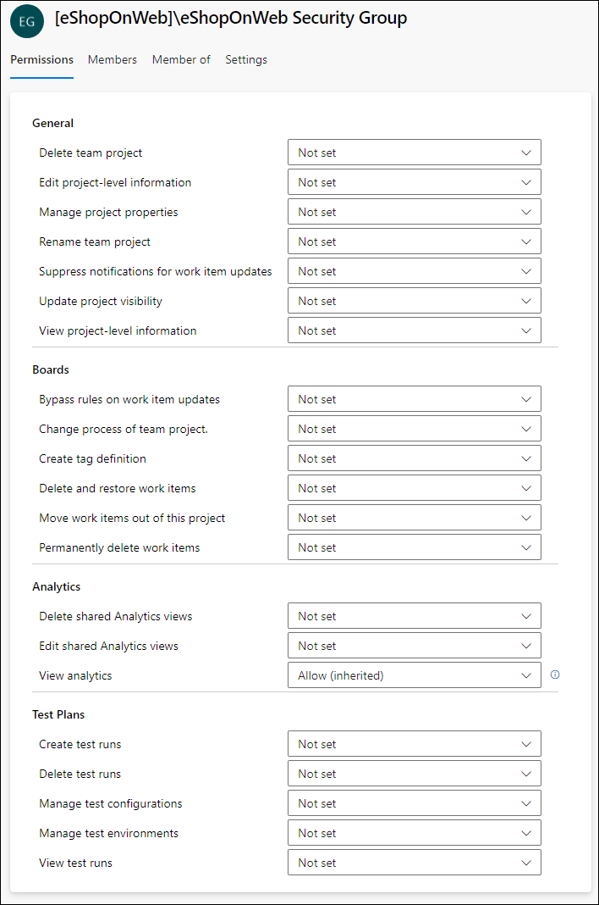

---
lab:
  title: Konfigurieren von Agents und Agentpools für sichere Pipelines
  module: 'Module 3: Configure secure access to pipeline resources'
---

# Konfigurieren von Agents und Agentpools für sichere Pipelines

In diesem Lab erfahren Sie, wie Sie Azure DevOps-Agents und -Agentpools konfigurieren und die Berechtigungen für diese Pools verwalten. Azure DevOps-Agentpools stellen die Ressourcen zum Ausführen Ihrer Build- und Releasepipelines bereit.

Diese Übung dauert ca. **25** Minuten.

## Vorbereitung

Sie benötigen ein Azure-Abonnement, eine Azure DevOps-Organisation und die eShopOnWeb-Anwendung, um den Labs zu folgen.

- Folgen Sie den Schritten, um Ihre [Lab-Umgebung zu überprüfen](APL2001_M00_Validate_Lab_Environment.md).
- PAT-Token für die Agent-Konfiguration.

## Anweisungen

Sie erstellen Agents und konfigurieren selbst gehostete Agents mit Windows. Wenn Sie Agents unter Linux oder MacOS konfigurieren möchten, befolgen Sie die Anweisungen in der [Azure DevOps-Dokumentation](https://docs.microsoft.com/azure/devops/pipelines/agents/v2-linux).

Beachten Sie während der Konfiguration Folgendes:

- **Verwalten Sie separate Agents pro Projekt**: Jeder Agent kann nur an einen Pool gebunden werden. Das Teilen von Agentpools für verschiedene Projekte kann zwar Infrastrukturkosten sparen, es entsteht jedoch auch das Risiko eines Lateral Movements. Daher empfiehlt es sich, separate Agentpools mit dedizierten Agents für jedes Projekt zu haben, um Kreuzkontaminationen zu verhindern.
- **Verwenden von Konten mit geringen Berechtigungen zum Ausführen von Agents**: Das Ausführen eines Agents unter einer Identität mit direktem Zugriff auf Azure DevOps-Ressourcen kann ein Sicherheitsrisiko darstellen. Das Ausführen des Agents unter einem nicht privilegierten lokalen Konto wie Network Service ist ratsam, da dies das Risiko minimiert.
- **Achten Sie auf irreführende Gruppennamen**: Die Gruppe „Project Collection Service Accounts“ in Azure DevOps stellt ein potenzielles Sicherheitsrisiko dar. Das Ausführen von Agents mit einer Identität, die Teil dieser Gruppe ist und von Azure AD unterstützt wird, kann die Sicherheit Ihrer gesamten Azure DevOps-Organisation gefährden.
- **Vermeiden Sie besonders privilegierte Konten für selbst gehostete Agents**: Wenn Sie besonders privilegierte Konten verwenden, um selbst gehostete Agents auszuführen, insbesondere für den Zugriff auf Geheimnisse oder Produktionsumgebungen, kann Ihr System schwerwiegenden Bedrohungen ausgesetzt werden, wenn eine Pipeline kompromittiert ist.
- **Priorisieren von Sicherheit**: Verwenden Sie zum Schützen Ihrer Systeme das am wenigsten privilegierte Konto, um selbst gehostete Agents auszuführen. Sie könnten beispielsweise Ihr Computerkonto oder eine verwaltete Dienstidentität verwenden. Es ist auch ratsam, Azure Pipelines den Zugriff auf Geheimnisse und Umgebungen zu ermöglichen.

### Übung 1: Erstellen von Agents und Konfigurieren von Agentpools

In dieser Übung erstellen Sie einen Agent und konfigurieren Agentpools.

#### Aufgabe 1: Erstellen eines Agentpools

1. Navigieren Sie zum Azure DevOps-Portal unter `https://dev.azure.com` und öffnen Sie Ihre Organisation.

1. Öffnen Sie das Projekt **eShopOnWeb** , und wählen Sie die Option **Projekteinstellungen** im linken unteren Menü aus.

1. Wählen Sie in **Pipelines > Agentpools** die Schaltfläche **Pool hinzufügen** aus.

1. Wählen Sie den **selbst gehosteten** Pooltyp aus.

1. Geben Sie einen Namen für den Agentpool an, z. B. **eShopOnWebSelfPool**, und fügen Sie eine optionale Beschreibung hinzu.

1. Lassen Sie die Option **Allen Pipelines die Zugriffsberechtigung gewähren** deaktiviert.

    

1. Klicken Sie auf die Schaltfläche **Erstellen**, um den Agentpool zu erstellen.

#### Aufgabe 2: Erstellen eines Agents

1. Wählen Sie den neu erstellten Agentpool und dann die Registerkarte **Agents** aus.

1. Wählen Sie die Schaltfläche **Neuer Agent** und dann die Schaltfläche **Herunterladen** aus dem **Download-Agent** im neuen Popupfenster aus.

1. Folgen Sie den Installationsanweisungen, um den Agent auf Ihrem Computer über das Popupfenster zu installieren.
   1. Führen Sie die folgenden Befehle aus PowerShell aus, um einen neuen Agentordner auf Ihrem Computer zu erstellen.

        ```powershell
        mkdir agent ; cd agent        
        ```

        > [!NOTE]
        > Stellen Sie sicher, dass Sie sich im Stammordner Ihres Benutzerprofils oder in dem Ordner befinden, in dem Sie den Agent installieren möchten.

   2. Wenn Sie den Ordner **Herunterladen** auf Ihrem Computer auswählen, führen Sie in PowerShell den vorgeschlagenen Befehl aus:

        ```powershell
        Add-Type -AssemblyName System.IO.Compression.FileSystem ; [SysteIO.Compression.ZipFile]::ExtractToDirecto("$HOME\Downloads\vsts-agent-win-x64-3.220.2.zip", "$PWD")
        
        ```
        > [!NOTE]
        > Wenn Sie den Agent an einen anderen Speicherort heruntergeladen haben, ersetzen Sie den Pfad im obigen Befehl.

#### Aufgabe 3: Erstellen eines PAT-Tokens

Erstellen Sie vor dem Konfigurieren Ihres Agents ein neues PAT-Token, oder wählen Sie ein vorhandenes Token aus. Führen Sie die folgenden Schritte aus, um ein neues PAT-Token zu erstellen:

1. Navigieren Sie zum Azure DevOps-Portal unter `https://dev.azure.com` und öffnen Sie Ihre Organisation.

1. Navigieren Sie zum eShopOnWeb-Projekt, und wählen Sie die Option **Benutzereinstellungen** im oberen rechten Menü (links neben dem Benutzerprofilbild) aus.

1. Wählen Sie das Menü **Persönliche Zugriffstoken** aus.

    

1. Wählen Sie die Schaltfläche **Neues Token** aus.

1. Geben Sie einen Namen für das Token an, z. B. ** eShopOnWebToken**.

1. Wählen Sie die Azure DevOps-Organisation aus, für die Sie das Token verwenden möchten.

1. Legen Sie das Ablaufdatum für das Token fest (wird nur zum Konfigurieren des Agents verwendet).

1. Wählen Sie den benutzerdefinierten Bereich aus.

1. Wählen Sie diese Option aus, um alle Bereiche anzuzeigen.

1. Wählen Sie den Bereich **Agentpools (Lesen und Verwalten)** aus.

1. Wählen Sie die Schaltfläche **Erstellen** aus, um das Token zu erstellen.

1. Kopieren Sie den Tokenwert, und speichern Sie ihn an einem sicheren Ort (Sie werden ihn nicht mehr sehen können. Sie können das Token nur erneut generieren).

    

    > [!IMPORTANT]
    > Verwenden Sie die letzte Berechtigungsoption, **Agentpools (Lesen und Verwalten)** nur für die Agentkonfiguration. Stellen Sie außerdem sicher, dass Sie das Mindestablaufdatum für das Token festlegen, wenn dies der einzige Zweck des Tokens ist. Sie können ein neues Token mit den gleichen Berechtigungen erstellen, wenn Sie den Agent erneut konfigurieren müssen.

#### Aufgabe 4: Konfigurieren des Agents

1. Öffnen Sie ein neues PowerShell-Fenster, und navigieren Sie zum Agentordner, den Sie im vorherigen Schritt erstellt haben.

1. Führen Sie den folgenden Befehl aus, um mit dem Konfigurieren Ihres Agents zu beginnen:

    ```powershell
    .\config.cmd
    ```

    > [!NOTE]
    > Führen Sie den Agent optional interaktiv aus, indem Sie .\run.cmd ausführen. Während der interaktiven Ausführung können Sie das Eingabeaufforderungsfenster nicht schließen.

1. Geben Sie die folgenden Informationen ein, wenn Sie zur Konfiguration des Agents aufgefordert werden:
    - Geben Sie die URL der Azure DevOps-Organisation ein: `https://dev.azure.com/`{your organization name}.
    - Wählen Sie den Authentifizierungstyp aus: **PAT**.
    - Geben Sie den PAT-Tokenwert ein, den Sie im vorherigen Schritt erstellt haben.
    - Geben Sie den Namen des Agentpools **eShopOnWebSelfPool** ein, den Sie im vorherigen Schritt erstellt haben.
    - Geben Sie den Agentnamen **eShopOnWebSelfAgent** ein.
    - Wählen Sie den Agentarbeitsordner aus (default is _work).
    - Wählen Sie den Agentausführungsmodus aus (Y für die Ausführung als Dienst).
    - Geben Sie „Y“ ein, um SERVICE_SID_TYPE_UNRESTRICTED für den Agentdienst zu aktivieren (nur Windows).
    - Geben Sie das Benutzerkonto ein, das für den Dienst verwendet werden soll.

        > [!IMPORTANT]
        > Für die Ausführung des Agentdiensts sollten Sie keine Konten mit hohen Berechtigungen verwenden. Verwenden Sie stattdessen ein Konto mit niedriger Berechtigung, das die für den Betrieb des Diensts erforderlichen Mindestberechtigungen enthält. Dieser Ansatz trägt dazu bei, ein sicheres und stabiles Umfeld zu erhalten.

    - Geben Sie an, ob der Dienst nicht sofort nach Abschluss der Konfiguration gestartet werden soll (N zum Starten des Diensts).

        

    - Überprüfen Sie den Agentstatus, indem Sie zum Agentpool navigieren und auf die Registerkarte **Agents** klicken. Der neue Agent sollte in der Liste angezeigt werden.

        

Weitere Informationen zu Windows-Agents finden Sie unter: [Selbstgehostete Windows-Agents](https://learn.microsoft.com/azure/devops/pipelines/agents/windows-agent)

### Übung 2: Erstellen und Konfigurieren einer neuen Sicherheitsgruppe für den Agentpool

In dieser Übung erstellen Sie eine neue Sicherheitsgruppe für den Agentpool.

#### Aufgabe 1: Erstellen einer neuen Sicherheitsgruppe

1. Navigieren Sie zum Azure DevOps-Portal unter `https://dev.azure.com` und öffnen Sie Ihre Organisation.

1. Öffnen Sie das Projekt **eShopOnWeb** , und wählen Sie die Option **Projekteinstellungen** im linken unteren Menü aus.

1. Öffnen Sie die „Berechtigungen“ unter „Allgemein“.

1. Wählen Sie die Schaltfläche **Neue Gruppe** aus.

1. Geben Sie einen Namen für die Gruppe an, z. B. **eShopOnWeb-Sicherheitsgruppe**.

1. Fügen Sie die Benutzer hinzu, die Teil der Gruppe sein sollen.

1. Wählen Sie die Schaltfläche **Erstellen** aus, um die Gruppe zu erstellen.

    

#### Aufgabe 2: Konfigurieren der Sicherheitsgruppe

1. Wählen Sie die neue Gruppe aus, um deren Registerkarte **Berechtigungen** anzuzeigen.

1. Verweigern Sie unnötige Berechtigungen für die Gruppe, z. B. **Teamprojekt umbenennen**, **Arbeitsaufgaben endgültig löschen** oder andere Berechtigungen, über die die Gruppe nicht verfügen soll, da sie nur für den Agentpool verwendet wird.

    

    > [!IMPORTANT]
    > Wenn Sie Berechtigungen beibehalten, über die die Gruppe nicht verfügen soll, können Skripts oder Aufgaben, die auf dem Agent ausgeführt werden, die Gruppenberechtigungen verwenden, um ungewünschte Aktionen auszuführen.

### Übung 3: Verwalten von Agentpoolberechtigungen

In dieser Übung verwalten Sie Berechtigungen für den Agentpool.

1. Navigieren Sie zum Azure DevOps-Portal unter `https://dev.azure.com` und öffnen Sie Ihre Organisation.

1. Öffnen Sie das Projekt **eShopOnWeb** , und wählen Sie die Option **Projekteinstellungen** im linken unteren Menü aus.

1. Wählen Sie **Pipelines** und dann **Agentpools** aus.

1. Wählen Sie den Agentpool **eShopOnWebSelfPool** aus.

1. Wählen Sie in der Detailansicht des Agentpools die Registerkarte **Sicherheit** aus.

1. Wählen Sie die Schaltfläche **Hinzufügen** aus, und fügen Sie die neue Gruppe **eShopOnWeb-Sicherheitsgruppe** zu den Benutzerberechtigungen des Agentpools hinzu.

1. Wählen Sie die entsprechende Rolle für den Benutzer oder die Gruppe aus, z. B. Agentpoolleser, Benutzer oder Administrator. Wählen Sie in diesem Fall **Benutzer** aus.

1. Wählen Sie „Hinzufügen“ aus, um die Berechtigungen anzuwenden.

    

Jetzt können Sie den Agentpool in Ihren Pipelines sicher verwenden. Weitere Informationen zu Agentpools finden Sie unter: [Agentpools](https://learn.microsoft.com/azure/devops/pipelines/agents/pools-queues).

### Übung 4: Entfernen der im Lab verwendeten Ressourcen

1. Beenden und entfernen Sie den Agentdienst, indem Sie `.config.cmd remove` ausführen.

1. Löschen des Agentpools.

1. Löschen der Sicherheitsgruppe.

1. Widerrufen des PAT-Tokens.

## Überprüfung

In diesem Lab haben Sie erfahren, wie Sie Azure DevOps selbstgehostete Agents und Agentpools konfigurieren und die Berechtigungen für diese Pools verwalten. Durch die effektive Verwaltung von Berechtigungen können Sie sicherstellen, dass die richtigen Benutzer Zugriff auf die benötigten Ressourcen haben, während die Sicherheit und Integrität Ihrer DevOps-Prozesse beibehalten werden.
