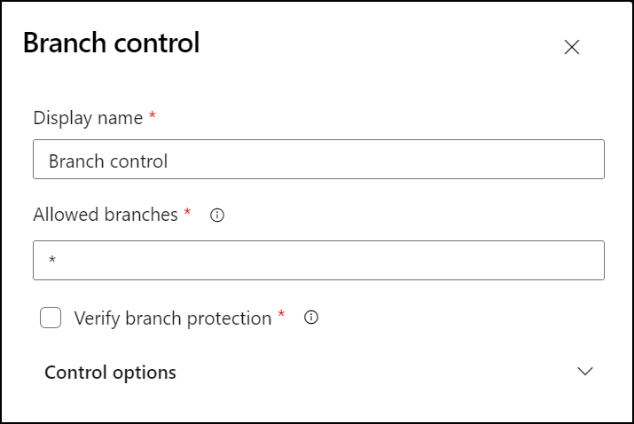
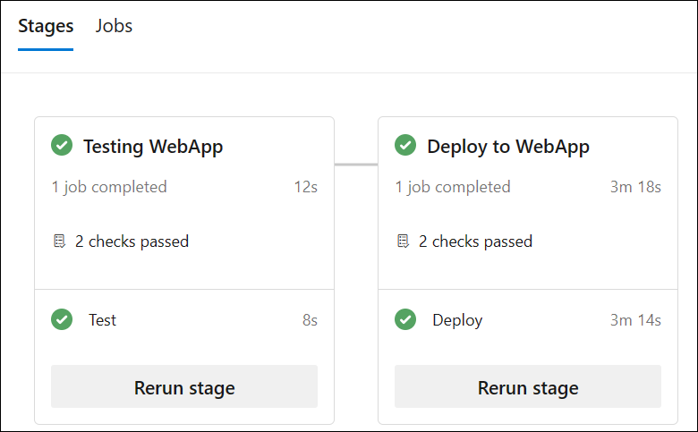

---
lab:
  title: Konfigurieren und Überprüfen von Berechtigungen
  module: 'Module 4: Configure and validate permissions'
---

# Konfigurieren und Überprüfen von Berechtigungen

In diesem Lab richten Sie eine sichere Umgebung ein, die dem Prinzip der geringsten Rechte entspricht, um sicherzustellen, dass die Mitglieder nur auf die Ressourcen zugreifen können, die sie für die Ausführung ihrer Aufgaben benötigen, und um potenzielle Sicherheitsrisiken zu minimieren. Dies umfasst das Konfigurieren und Überprüfen von Benutzer- und Pipelineberechtigungen sowie das Einrichten von Genehmigungen und Branchüberprüfungen in Azure DevOps.

Diese Übungen dauern ungefähr **30** Minuten.

## Vorbereitung

Sie benötigen ein Azure-Abonnement, eine Azure DevOps-Organisation und die eShopOnWeb-Anwendung, um den Labs zu folgen.

- Folgen Sie den Schritten, um Ihre [Lab-Umgebung zu überprüfen](APL2001_M00_Validate_Lab_Environment.md).
- Installieren Sie einen selbstgehosteten Agent, indem Sie das Lab [Konfigurieren von Agents und Agentpools für sichere Pipelines](/Instructions/Labs/APL2001_M03_L03_Configure_Agents_And_Agent_Pools_for_Secure_Pipelines.md) oder die Schritte in [Installieren eines selbst gehosteten Agents](https://docs.microsoft.com/azure/devops/pipelines/agents/v2-windows?view=azure-devops#install) befolgen.

## Anweisungen

### Übung 1: CI-Pipeline importieren und pipelinespezifische Berechtigungen konfigurieren

In dieser Übung importieren Sie die CI-Pipeline für die eShopOnWeb-Anwendung und führen diese aus und konfigurieren pipelinespezifische Berechtigungen.

#### Aufgabe 1:  CI-Pipeline importieren und ausführen

> [!NOTE]
> Importieren Sie zunächst die CI-Pipeline mit dem Namen [eshoponweb-ci.ymll](https://github.com/MicrosoftLearning/eShopOnWeb/blob/main/.ado/eshoponweb-ci.yml).

1. Navigieren Sie zum Azure DevOps-Portal unter `https://dev.azure.com` und öffnen Sie Ihre Organisation.

1. Öffnen Sie das **eShopOnWeb**-Projekt.

1. Navigieren Sie zu **Pipelines > Pipelines**.

1. Wählen Sie **Neue Pipeline** aus.

1. Wählen Sie **Azure Repos Git (Yaml)**.

1. Wählen Sie das Repository **eShopOnWeb** aus.

1. Wählen Sie die Option **Vorhandene Azure Pipelines-YAML-Datei** aus.

1. Wählen Sie die Datei **/.ado/eshoponweb-ci.yml** und dann **Weiter** aus.

1. Klicken Sie auf die Schaltfläche **Ausführen**, um die Pipeline auszuführen.

   > [!NOTE]
   > Ihre Pipeline nimmt einen Namen auf der Grundlage des Projektnamens an. Benennen Sie sie um, um die Pipeline besser zu identifizieren.

1. Wechseln Sie zu **Pipelines > Pipelines**, wählen Sie zunächst die zuletzt erstellte Pipeline, dann die Auslassungspunkte und anschließend die Option **Umbenennen/Verschieben** aus.

1. Nennen Sie sie **eshoponweb-ci**, und wählen Sie **Speichern** aus.

#### Aufgabe 2: Pipeline mit bestimmten Berechtigungen konfigurieren und ausführen

> [!NOTE]
> Um den in dieser Aufgabe konfigurierten Agentpool zu verwenden, müssen Sie zuerst den virtuellen Azure-Computer starten, auf dem der Agent gehostet wird. 

1. Öffnen Sie das Azure-Portal unter `https://portal.azure.com` in Ihrem Browser.

1. Navigieren Sie im Azure-Portal zu der Seite, auf der der virtuelle Azure-Computer **eshoponweb-vm** angezeigt wird, den Sie in diesem Lab bereitgestellt haben

1. Wählen Sie auf der Seite des virtuellen Azure-Computers **eshoponweb-vm** auf der Symbolleiste die Option **Starten** aus, um ihn zu starten.

   > [!NOTE]
   > Als Nächstes konfigurieren Sie die CI-Pipeline für die Ausführung mit dem entsprechenden Agentpool und überprüfen die Berechtigungen zum Ausführen der Pipeline. Sie müssen über Berechtigungen zum Bearbeiten der Pipeline verfügen und dem Agentpool Berechtigungen hinzufügen.

1. Wechseln Sie zu den Projekteinstellungen, und wählen Sie unter **Pipelines** die Option **Agentpools** aus.

1. Öffnen Sie den **eShopOnWebSelfPool**-Agentpool.

1. Wählen Sie die Registerkarte **Security** (Sicherheit) aus.

1. Wählen Sie zunächst im Abschnitt **Pipelineberechtigungen** die Schaltfläche **+** und dann die **eshoponweb-ci**-Pipeline aus, um sie der Liste der Pipelines mit Zugriff auf den Agentpool hinzuzufügen.

1. Navigieren Sie zur **eShopOnWeb**-Projektseite.

1. Navigieren Sie auf der **eShopOnWeb**-Projektseite zu **Pipelines > Pipelines**.

1. Wählen Sie zunächst die **eshoponweb-ci**-Pipeline und dann **Bearbeiten** aus.

1. Aktualisieren Sie im Unterabschnitt **Aufträge** des Abschnitts **Phasen** den Wert der **Pool**-Eigenschaft, um auf den selbstgehosteten Agentpool **eShopOnWebSelfPool** zu verweisen, den Sie in dieser Aufgabe konfiguriert haben, sodass er das folgende Format aufweist:

   ```yaml
     jobs:
     - job: Build
       pool: eShopOnWebSelfPool
       steps:
       - task: DotNetCoreCLI@2
   ```

1. Wählen Sie zunächst **Speichern** und dann den direkten Commit zum Mainbranch aus.

1. Wählen Sie erneut **Speichern** aus.

1. Wählen Sie die Option zum **Ausführen** der Pipeline aus, und klicken Sie dann erneut auf die Option **Ausführen**.

1. Stellen Sie sicher, dass der Buildauftrag auf dem **eShopOnWebSelfAgent**-Agent ausgeführt und erfolgreich abgeschlossen wird.

#### Aufgabe 3: CD-Pipeline konfigurieren und Berechtigungen überprüfen

1. Wechseln Sie im Azure DevOps-Portal auf der **eShopOnWeb**-Projektseite zu **Pipelines > Pipelines**.

1. Wählen Sie **Neue Pipeline** aus.

1. Wählen Sie **Azure Repos Git (Yaml)**.

1. Wählen Sie das Repository **eShopOnWeb** aus.

1. Wählen Sie die Option **Vorhandene Azure Pipelines-YAML-Datei** aus.

1. Wählen Sie zunächst die Datei **/.ado/eshoponweb-cd-webapp-code.yml** und dann **Weiter** aus.

1. Passen Sie in der YAML-Pipelinedefinition im Abschnitt „Variablen“ Folgendes an:

   - **AZ400-EWebShop-NAME** mit dem Namen Ihrer Einstellung, z. B. **rg-eshoponweb-perm**.
   - **Standort** mit dem Namen der Azure-Region, in der Sie Ihre Ressourcen bereitstellen möchten, z. B. **southcentralus**.
   - Ersetzen Sie **IHRE-ABONNEMENT-ID** durch Ihre Azure-Abonnement-ID.
   - **azure subs** mit **azure subs managed**
   - **az400-webapp-NAME** mit einem global eindeutigen Namen der Web-App, die bereitgestellt werden soll, z. B. die Zeichenfolge **eshoponweb-lab-perm-** gefolgt von einer zufälligen sechsstelligen Zahl. 

1. Aktualisieren Sie die YAML-Datei, um den **eShopOnWebSelfPool**-Agentpool zu verwenden. Legen Sie dazu den Abschnitt **Pool** auf den folgenden Wert fest:

   ```yaml
     jobs:
     - job: Deploy
       pool: eShopOnWebSelfPool
       steps:
       #download artifacts
       - download: eshoponweb-ci
   ```

1. Wählen Sie die Option **Speichern und Ausführen** und dann erneut **Speichern und Ausführen** aus.

1. Öffnen Sie die Pipeline, und beachten Sie die Meldung „Diese Pipeline benötigt die Berechtigung für den Zugriff auf 2 Ressourcen, bevor diese Ausführung weiterhin für WebApp bereitstellen kann“. Wählen Sie zunächst **Ansicht** und dann **Zulassen** aus, damit die Pipeline ausgeführt werden kann.

   

1. Benennen Sie die Pipeline in **eshoponweb-cd-webapp-code** um.

### Übung 2: Konfigurieren und Überprüfen von Genehmigungs- und Branchüberprüfungen

In dieser Übung konfigurieren und überprüfen Sie die Genehmigungen und Branchüberprüfungen für die CD-Pipeline.

#### Aufgabe 1: Umgebung erstellen und Genehmigungen und Überprüfungen hinzufügen

1. Wählen Sie im Azure DevOps-Portal auf der **eShopOnWeb**-Projektseite **Pipelines > Umgebungen** aus.

1. Klicken Sie auf **Umgebung erstellen**.

1. Benennen Sie die Umgebung **Test**, wählen Sie zunächst **Keine** als Ressource und dann **Erstellen** aus.

1. Wählen Sie **Neue Umgebung** aus, erstellen Sie eine neue Umgebung mit dem Namen **Production**, stellen Sie sicher, dass **Keine** als Ressource ausgewählt ist, und klicken Sie auf **Erstellen**.

1. Öffnen Sie die **Test**-Umgebung, wählen Sie die Registerkarte **Genehmigungen und Überprüfungen** aus.

1. Wählen Sie **Genehmigungen** aus.

1. Geben Sie im Textfeld **Genehmigende Person** Ihren Benutzernamen ein.

1. Geben Sie die Anweisungen **Genehmigen der Bereitstellung für Test**, und wählen Sie **Erstellen** aus.

   

1. Wählen Sie zunächst die Schaltfläche **+**, dann **Steuerung von Branches** und anschließend **Weiter** aus.

1. Behalten Sie im Feld **Zulässige Branches** die Standardeinstellung bei, und wählen Sie **Erstellen** aus. Sie können bei Bedarf weitere Branches hinzufügen.

   

1. Erstellen Sie eine weitere Umgebung mit dem Namen **Production**, und führen Sie die gleichen Schritte aus, um Genehmigungen und die Steuerung von Branches hinzuzufügen. Um die Umgebungen zu unterscheiden, fügen Sie die Anweisungen **Genehmigen der Bereitstellung für Production** hinzu und legen Sie die zulässigen Branches auf **refs/heads/main** fest.

> [!NOTE]
> Sie können weitere Umgebungen hinzufügen und Genehmigungen und Steuerungen von Branches für sie konfigurieren. Darüber hinaus können Sie **Sicherheit** so konfigurieren, dass Benutzer*innen oder Gruppen zur Umgebung mit Rollen wie *Benutzer*in*, *Ersteller*in* oder *Leser*in* hinzugefügt werden.

#### Aufgabe 2: CD-Pipeline für die Verwendung der neuen Umgebung konfigurieren

1. Wählen Sie im Azure DevOps-Portal auf der **eShopOnWeb**-Projektseite **Pipelines > Pipelines** aus.

1. Öffnen Sie die **eshoponweb-cd-webapp-code**-Pipeline.

1. Wählen Sie **Bearbeiten** aus.

1. Ersetzen Sie die Zeilen 21–27 (direkt über dem Kommentar **#download artifacts**) durch den folgenden Inhalt:

   ```yaml
   stages:
   - stage: Test
     displayName: Testing WebApp
     jobs:
     - deployment: Test
       pool: eShopOnWebSelfPool
       environment: Test
       strategy:
         runOnce:
           deploy:
             steps:
             - script: echo Hello world! Testing environments!
   - stage: Deploy
     displayName: Deploy to WebApp
     jobs:
     - deployment: Deploy
       pool: eShopOnWebSelfPool
       environment: Production
       strategy:
         runOnce:
           deploy:
             steps:
             - checkout: self
   ```

   > [!NOTE]
   > Sie müssen alle Zeilen nach dem obigen Code sechs Leerzeichen nach rechts verschieben, um sicherzustellen, dass die YAML-Einzugsregeln erfüllt sind.

   Ihre Pipeline sollte wie folgt aussehen:

   

1. Wählen Sie **Speichern** (zweimal) und **Ausführen** (zweimal) aus.

1. Öffnen Sie die Phase **Testen von WebApp** der Pipeline, und beachten Sie die Meldung **1 Genehmigung muss von Ihnen überprüft werden, bevor diese Ausführung mit dem Testen von WebApp fortfahren kann**. Wählen Sie zunächst **Überprüfen** und dann **Genehmigen** aus.

   

1. Warten Sie, bis die Ausführung der Pipeline abgeschlossen ist, öffnen Sie das Pipelineprotokoll, und überprüfen Sie, ob die Phase **Testen von WebApp** erfolgreich ausgeführt wurde.

   

1. Zurück zur Pipeline, und Sie sehen, dass die Phase **Bereitstellen für WebApp** auf die Genehmigung wartet. Wählen Sie **Überprüfen** und **Genehmigen** aus, wie Sie es zuvor für die Phase **Testen von WebApp** getan haben.

1. Warten Sie, bis die Ausführung der Pipeline abgeschlossen ist, und überprüfen Sie, ob die Phase **Bereitstellen für WebApp** erfolgreich ausgeführt wurde.

   

> [!NOTE]
> Sie sollten in der Lage sein, die Pipeline erfolgreich mit den Genehmigungen und Branchüberprüfungen in beiden Umgebungen – Test und Produktion – auszuführen.

### Übung 3: Bereinigung von Azure- und Azure DevOps-Ressourcen durchführen

In dieser Übung entfernen Sie Azure- und Azure DevOps-Ressourcen, die in diesem Lab erstellt wurden.

#### Aufgabe 1: Entfernen Sie Azure-Ressourcen,

1. Navigieren Sie im Azure-Portal zur Ressourcengruppe **rg-eshoponweb-perm** mit bereitgestellten Ressourcen, und wählen Sie **Ressourcengruppe löschen** aus, um alle in diesem Lab erstellten Ressourcen zu löschen.

#### Aufgabe 2: Azure DevOps-Pipelines entfernen

1. Navigieren Sie zum Azure DevOps-Portal unter `https://dev.azure.com` und öffnen Sie Ihre Organisation.

1. Öffnen Sie das **eShopOnWeb**-Projekt.

1. Navigieren Sie zu **Pipelines > Pipelines**.

1. Wechseln Sie zu **Pipelines > Pipelines**, und löschen Sie die vorhandenen Pipelines.

#### Aufgabe 3: Azure DevOps-Repository neu erstellen

1. Wählen Sie im Azure DevOps-Portal im **eShopOnWeb-**-Projekt in der unteren linken Ecke die Option **Projekteinstellungen** aus.

1. Wählen Sie im vertikalen Menü **Projekteinstellungen** auf der linken Seite im Abschnitt **Repositorys** die Option **Repositorys** aus.

1. Zeigen Sie im Bereich **Alle Repositorys** mit der Maus auf das rechte Ende des **eShopOnWeb**-Repositoryeintrags, bis das Symbol mit den Auslassungszeichen **Weitere Optionen** angezeigt wird, wählen Sie es aus, und wählen Sie im Menü **Weitere Option** die Option **Umbenennen** aus.  

1. Geben Sie im Fenster **eShopOnWeb-Repository umbenennen** im Textfeld **Repositoryname** den Text **eShopOnWeb_old** ein, und wählen Sie **Umbenennen** aus.

1. Wählen Sie im Bereich **Alle Repositorys** die Option **+ Erstellen** aus.

1. Geben Sie im Bereich **Repository erstellen** im Textfeld **Repositoryname** den Text **eShopOnWeb** ein, deaktivieren Sie das Kontrollkästchen **README hinzufügen**, und wählen Sie **Erstellen** aus.

1. Zeigen Sie im Bereich **Alle Repositorys** mit der Maus auf des rechte Ende des **eShopOnWeb_old**-Repositoryeintrags, bis das Symbol mit den Auslassungszeichen **Weitere Optionen** angezeigt wird, wählen Sie es aus, und wählen Sie im Menü **Weitere Option** die Option **Umbenennen** aus.  

1. Geben Sie im Fenster **eShopOnWeb_old-Repository löschen** den Text **eShopOnWeb_old** ein, und wählen Sie **Löschen** aus.

1. Wählen Sie im linken Navigationsmenü des Azure DevOps-Portals die Option **Repositorys** aus.

1. Wählen Sie im Bereich **eShopOnWeb ist leer. Code hinzufügen!** die Option **Repository importieren** aus.

1. Fügen Sie im Fenster **Git-Repository importieren** die folgende URL `https://github.com/MicrosoftLearning/eShopOnWeb` ein, und wählen Sie **Importieren** aus:

## Überprüfung

In diesem Lab haben Sie gelernt, wie Sie eine sichere Umgebung einrichten, die dem Prinzip der geringsten Rechte entspricht, um sicherzustellen, dass die Mitglieder nur auf die Ressourcen zugreifen können, die sie für die Ausführung ihrer Aufgaben benötigen, und um potenzielle Sicherheitsrisiken zu minimieren. Sie haben Benutzer- und Pipelineberechtigungen konfiguriert und überprüft und Genehmigungen und Branchüberprüfungen in Azure DevOps eingerichtet.
