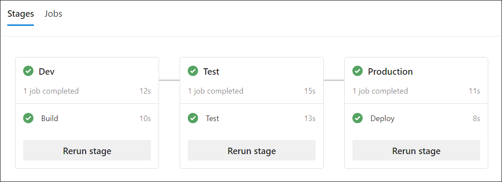

---
lab:
  title: Erweitern einer Pipeline für die Verwendung mehrerer Vorlagen
  module: 'Module 5: Extend a pipeline to use multiple templates'
---

# Erweitern einer Pipeline für die Verwendung mehrerer Vorlagen

In diesem Lab lernen Sie, wie wichtig es ist, eine Pipeline auf mehrere Vorlagen zu erweitern und wie Sie Azure DevOps dafür verwenden. Dieses Lab behandelt grundlegende Konzepte und Best Practices für das Erstellen einer mehrstufigen Pipeline, einer Variablenvorlage, einer Auftragsvorlage und einer Phasenvorlage.

Diese Übung dauert ca. **30** Minuten.

## Vorbereitung

Sie benötigen ein Azure-Abonnement, eine Azure DevOps-Organisation und die eShopOnWeb-Anwendung, um den Laboren zu folgen.

- Führen Sie die Schritte aus, um Ihre Lab-Umgebung[ zu ](APL2001_M00_Validate_Lab_Environment.md)überprüfen.

## Anweisungen

### Übung 1: Erstellen einer mehrstufigen YAML-Pipeline

#### Aufgabe 1: Erstellen einer mehrstufigen Standard YAML-Pipeline

1. Navigieren Sie zum Azure DevOps-Portal unter `https://dev.azure.com` und öffnen Sie Ihre Organisation.

1. Öffnen Sie das **eShopOnWeb-Projekt** .

1. Navigieren Sie in Azure Pipelines zu PipelinesPipelines.

1. Wählen Sie **die Schaltfläche "Neue Pipeline"** aus.

1. Wählen Sie **Azure Repos Git** (YAML) aus.

1. Wählen Sie das **eShopOnWeb-Repository** aus.

1. Wählen Sie **Starterpipeline** aus.

1. Ersetzen Sie den Inhalt von **azure-pipelines.yml** durch den folgenden Code.

    ```YAML
    trigger:
    - main

    pool:
      vmImage: 'windows-latest'

    stages:
    - stage: Dev
      jobs:
      - job: Build
        steps:
        - script: echo Build
    - stage: Test
      jobs:
      - job: Test
        steps:
        - script: echo Test
    - stage: Production
      jobs:
      - job: Deploy
        steps:
        - script: echo Deploy

    ```

1. Wählen Sie **Speichern und ausführen** aus. Wählen Sie aus, ob Sie einen Commit direkt auf die Standard Verzweigung ausführen oder eine neue Verzweigung erstellen möchten. Wählen Sie **die Schaltfläche "Speichern und Ausführen** " aus.

   > [!NOTE]
   > Wenn Sie eine neue Verzweigung erstellen, müssen Sie eine Pullanforderung erstellen, um die Änderungen an der Standard Verzweigung zusammenzuführen.

1. Die Pipeline wird mit den drei Phasen (Dev, Test und Production) und den entsprechenden Aufträgen ausgeführt. Warten Sie, bis die Pipeline abgeschlossen ist, und kehren Sie zur **Seite "Pipelines** " zurück.

    

1. Wählen Sie **...** (Weitere Optionen) auf der rechten Seite der soeben erstellten Pipeline aus, und wählen Sie " **Umbenennen/Verschieben**" aus.

1. Benennen Sie die Pipeline in **"eShopOnWeb-MultiStage-Main**" um, und wählen Sie "Speichern" aus****.

#### Aufgabe 2: Erstellen einer Variablenvorlage

1. Wechseln Sie zu **"Repos" > "Dateien**".

1. Erweitern Sie den **ADO-Ordner** , und klicken Sie auf " **Neue Datei"**.

1. Nennen Sie die Datei **"eshoponweb-variables.yml**", und klicken Sie auf "Erstellen"****.

1. Fügen Sie der Datei den folgenden Code hinzu:

    ```YAML
    variables:
      resource-group: 'YOUR-RESOURCE-GROUP-NAME'
      location: 'southcentralus' #name of the Azure region you want to deploy your resources
      templateFile: '.azure/bicep/webapp.bicep'
      subscriptionid: 'YOUR-SUBSCRIPTION-ID'
      azureserviceconnection: 'YOUR-AZURE-SERVICE-CONNECTION-NAME'
      webappname: 'YOUR-WEB-APP-NAME'

    ```

    > [!IMPORTANT]
    > Ersetzen Sie die Werte der Variablen durch die Werte Ihrer Umgebung (Ressourcengruppe, Standort, Abonnement-ID, Azure-Dienstverbindung und Web App-Name).

1. Wählen Sie **Commit ausführen** aus, hinterlassen Sie einen Kommentar, und wählen Sie **Commit ausführen** erneut aus.

#### Aufgabe 3: Vorbereiten der Pipeline für die Verwendung von Vorlagen

1. Navigieren Sie in Azure Pipelines zu PipelinesPipelines.

1. Öffnen Sie die **eShopOnWeb-MultiStage-Main-Pipeline** .

1. Wählen Sie **Bearbeiten** aus.

1. Ersetzen Sie den Inhalt von **azure-pipelines.yml** durch den folgenden Code.

    ```YAML
    trigger:
    - main
    variables:
    - template: .ado/eshoponweb-variables.yml
    
    stages:
    - stage: Dev
      jobs:
      - template: .ado/eshoponweb-ci.yml
    - stage: Test
      jobs:
      - template: .ado/eshoponweb-cd-webapp-code.yml
    - stage: Production
      jobs:
      - job: Deploy
        steps:
        - script: echo Deploy to Production or Swap

    ```

1. Speichern Sie die Pipeline.

1. Wählen Sie aus, ob Sie einen Commit direkt auf die Standard Verzweigung ausführen oder eine neue Verzweigung erstellen möchten. Wählen Sie die Schaltfläche **Speichern** aus.

   > [!NOTE]
   > Wenn Sie eine neue Verzweigung erstellen, müssen Sie eine Pullanforderung erstellen, um die Änderungen an der Standard Verzweigung zusammenzuführen.

#### Aufgabe 4: Aktualisieren von CI/CD-Vorlagen

1. Navigieren Sie in Azure Pipelines zu PipelinesPipelines.

1. Bearbeiten Sie die **eshoponweb-ci** Pipeline.

1. Entfernen Sie alles über dem **Abschnitt "Aufträge** ".

    ```YAML
    #NAME THE PIPELINE SAME AS FILE (WITHOUT ".yml")
    # trigger:
    # - main
    
    resources:
      repositories:
        - repository: self
          trigger: none
    
    stages:
    - stage: Build
      displayName: Build .Net Core Solution

    ```

1. Speichern Sie die Pipeline.

1. Navigieren Sie in Azure Pipelines zu PipelinesPipelines.

1. Bearbeiten Sie die **eshoponweb-cd-webapp-code** pipeline.

1. Entfernen Sie alles über dem **Abschnitt "Aufträge** ".

    ```YAML
    #NAME THE PIPELINE SAME AS FILE (WITHOUT ".yml")
    
    # Trigger CD when CI executed successfully
    resources:
      pipelines:
        - pipeline: eshoponweb-ci
          source: eshoponweb-ci # given pipeline name
          trigger: true

    variables:
      resource-group: 'rg-eshoponweb'
      location: 'southcentralus'
      templateFile: '.azure/bicep/webapp.bicep'
      subscriptionid: ''
      azureserviceconnection: 'azure subs'
      webappname: 'eshoponweb-lab'
      # webappname: 'webapp-windows-eshop'
    
    stages:
    - stage: Deploy
      displayName: Deploy to WebApp`

    ```

1. Aktualisieren Sie den **Downloadschritt** auf:

    ```YAML
    - download: current
      artifact: Website
    - download: current
      artifact: Bicep
    ```

1. Speichern Sie die Pipeline.

1. (Optional) Aktualisieren Sie den Produktionsschritt, um Ihre Anwendung in einer anderen Umgebung bereitzustellen, oder tauschen Sie die Bereitstellungsplätze aus.

#### Aufgabe 5: Ausführen der Pipeline

1. Navigieren Sie in Azure Pipelines zu PipelinesPipelines.

1. Öffnen Sie die **eShopOnWeb-MultiStage-Main-Pipeline** .

1. Klicken Sie auf **Pipeline ausführen**.

1. Warten Sie, bis die Pipeline abgeschlossen ist, und überprüfen Sie die Ergebnisse.

    

### Übung 2: Entfernen der Azure-Lab-Ressourcen.

1. Öffnen Sie im Azure-Portal die erstellte Ressourcengruppe, und wählen Sie **"Ressourcengruppe** löschen" für alle erstellten Ressourcen in dieser Übung aus.

    

    > [!WARNING]
    > Denken Sie daran, alle neu erstellten Azure-Ressourcen zu entfernen, die Sie nicht mehr verwenden. Durch das Entfernen nicht verwendeter Ressourcen wird sichergestellt, dass keine unerwarteten Kosten anfallen.

## Überprüfung

In diesem Modul haben Sie gelernt, wie wichtig es ist, eine Pipeline auf mehrere Vorlagen zu erweitern und wie Sie Azure DevOps dafür verwenden. Dieses Lab behandelt grundlegende Konzepte und Best Practices für das Erstellen einer mehrstufigen Pipeline, einer Variablenvorlage, einer Auftragsvorlage und einer Phasenvorlage.
